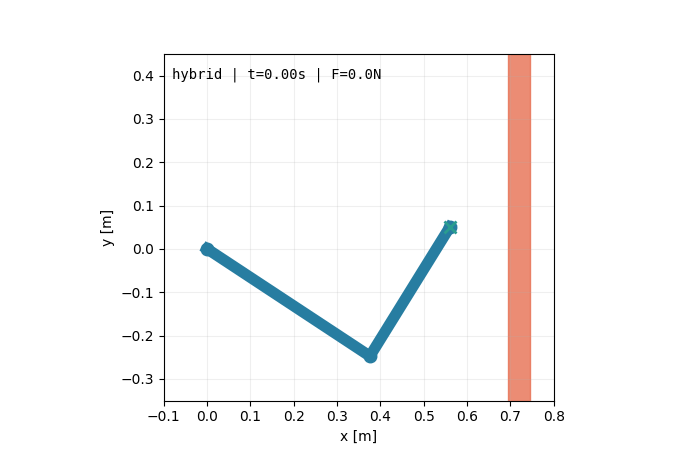
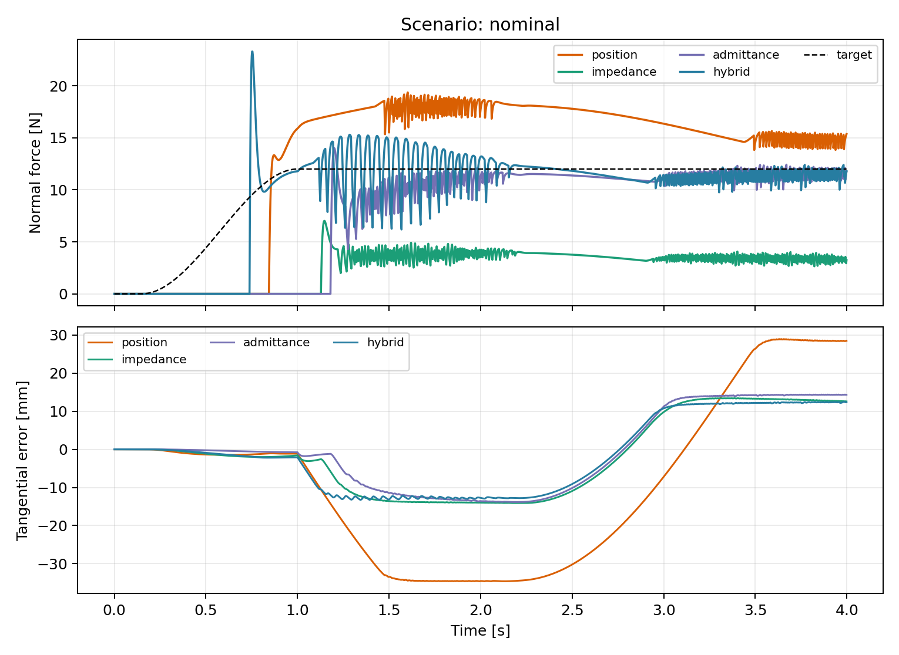

# Robot Arm Compliant Control Lab

一个可复现的机械臂接触控制项目：在同一 MuJoCo 环境中比较高刚度位置控制、
笛卡尔阻抗控制、导纳控制和力位混合控制，并量化墙体刚度、传感器噪声及控制延迟带来的影响。





## 为什么不是另一个“跑通就结束”的 Demo

- 控制器与仿真器解耦，控制律可以迁移到 ROS2 或真机接口。
- 同时报告力跟踪、切向轨迹、接触峰值、力矩、饱和率和计算时间。
- 保留不漂亮的结果：例如力位混合控制在延迟下仍能跟踪平均力，但原始接触峰值会增大。
- 测试覆盖运动学 Jacobian、IK、控制器轴向选择和 MuJoCo 闭环运行。

当前模型是一台自包含的 2-DOF 平面机械臂。末端沿墙面运动时，x 轴负责法向接触，
y 轴负责切向轨迹跟踪。这样既能把控制原理讲清楚，也不依赖外部机器人资产。

## 快速开始

```bash
python3 -m venv .venv
source .venv/bin/activate
pip install -e ".[dev]"

pytest
compliant-control-lab --output results --gif
```

如果只想快速验证某个控制器：

```bash
compliant-control-lab --controllers hybrid --duration 2.0 --output results/quick
```

## 控制方法

| 方法 | 法向 x 轴 | 切向 y 轴 | 用途 |
|---|---|---|---|
| Position | 高刚度 PD | 高刚度 PD | 接触控制基线 |
| Impedance | 低刚度弹簧-阻尼 | 轨迹阻抗 | 限制接触冲击 |
| Admittance | 接触力生成位置参考 | 位置内环 | 适合位置型机器人 |
| Hybrid | 接触力 PI | 位置 PD | 显式分离力与运动子空间 |

完整公式和实现对应关系见 [docs/control_theory.md](docs/control_theory.md)。

## 实验设计

所有实验使用相同初始状态、目标轨迹和随机种子：

1. `nominal`：标称墙体与低噪声力传感器。
2. `stiff_wall`：更短的接触时间常数，观察碰撞峰值。
3. `noisy_delay`：1 mm 位置噪声、0.6 N 力噪声和 20 ms 测量延迟。

力反馈通过一阶低通滤波模拟真实力传感器带宽。`force_rmse_n` 使用滤波后的反馈，
`peak_force_n` 使用 MuJoCo 原始接触力，避免滤波掩盖冲击。

标称场景的参考结果：

| 控制器 | 力 RMSE [N] | 原始峰值力 [N] | 切向 RMSE [mm] |
|---|---:|---:|---:|
| Position | 5.03 | 26.49 | 27.30 |
| Impedance | 8.42 | 12.32 | 12.21 |
| Admittance | 1.46 | 18.74 | 12.05 |
| Hybrid | 1.47 | 31.90 | 11.45 |

这里不存在“所有指标都最优”的控制器：阻抗控制峰值最小，但并不显式跟踪 12 N；
导纳控制的力跟踪和峰值更均衡；力位混合控制获得最小切向误差，但对瞬时接触和延迟更敏感。
完整结果见 [results/metrics.md](results/metrics.md)。

## 项目结构

```text
src/compliant_control_lab/
├── assets/planar_arm.xml   # 自包含 MuJoCo 模型
├── controllers.py          # 四种控制器
├── kinematics.py           # FK、IK、Jacobian
├── simulation.py           # 接触仿真、噪声、延迟和指标
├── experiments.py          # 批量实验 CLI
└── plotting.py             # 曲线和 GIF
tests/                      # 单元测试与闭环冒烟测试
docs/control_theory.md      # 推导、假设和局限性
results/                    # 可复现实验产物
```

## 面试时可以讨论的问题

- 为什么阻抗控制不等于力控制？
- 导纳外环的虚拟质量和阻尼如何影响接触稳定性？
- 力位混合控制为什么需要选择矩阵？
- 延迟为什么会放大原始接触峰值？
- 为什么同时报告滤波力 RMSE 和未滤波峰值？
- 从仿真迁移到真机时，还需要加入哪些安全状态和标定步骤？

## 下一步

- 将同一控制器接口接入 Franka Panda 与 6D wrench。
- 用 Pinocchio 提供 7-DOF Jacobian、重力补偿和零空间控制。
- 增加 ROS2 controller、实时线程、力矩/速度安全限幅与 watchdog。
- 在软垫、刚性墙和曲面上完成 Sim-to-Real 参数辨识。

## License

MIT
