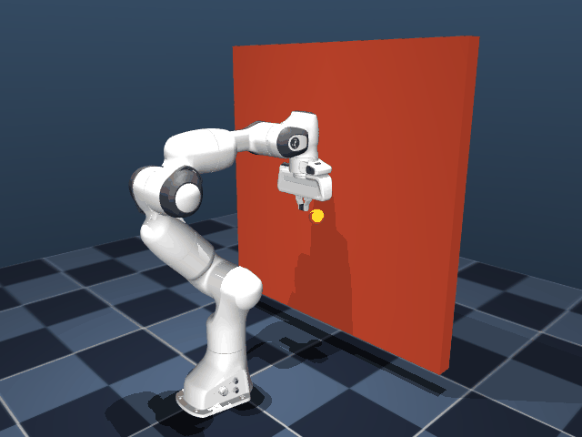
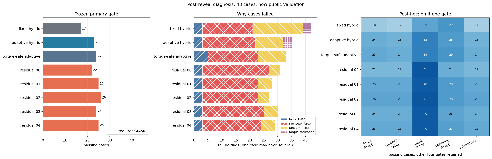

# Robot Arm Compliant Control Lab

[](https://github.com/LYHrmer/robot-arm-compliant-control-lab/actions/workflows/tests.yml)

Franka Panda 7-DOF 在 MuJoCo 中以 500 Hz 维持 12 N 法向接触力，同时沿墙面执行擦拭轨迹。
这个仓库比较固定增益、自适应柔顺控制和 bounded Residual RL，并保留每次实验的门槛、失败
case 与冻结产物。

当前版本停在一个清楚的失败点：加入关节力矩投影后，actuator saturation 在本次 48-case
评测中降为 0%，五个 Residual RL 策略却都没有通过预先声明的规则。主要问题是约 59.54 N
的首次接触峰值。所有 checkpoint 仅供仿真研究，禁止直接用于真机。



## v0.5 首次揭盲结果

机器人使用相同的 48 个仿真参数场景和相同的逐 case 噪声 seed。预注册规则要求五个 residual
策略分别达到 44/48，不能挑最好 seed 或改用平均通过率。

| 方法 | 通过数 | Force-tracking error P95 [N] | Raw peak P95 [N] | Tangent P95 [mm] | Saturation worst |
|---|---:|---:|---:|---:|---:|
| Fixed hybrid | 17/48 | 2.01 | 58.62 | 22.66 | 19.69% |
| Adaptive hybrid | 23/48 | 2.21 | 58.99 | 18.89 | 20.71% |
| Torque-safe adaptive | 24/48 | 2.33 | 59.54 | 18.89 | 0.00% |
| Torque residual（5 runs） | 22–26/48 | 1.98–2.12 | 59.54 | 15.98–16.50 | 0.00% |

`Force-tracking error` 在进入稳定任务阶段后由滤波力反馈计算；`Raw peak` 取完整轨迹中的未滤波
最大接触力，包含首次碰撞。因此表中的约 2 N 稳态误差和约 60 N 瞬时峰值并不矛盾。

主结果是 `FAIL`。Residual policy 改善了切向跟踪，torque projection 也完成了限幅职责；
接触冲击仍然超过 35 N gate。仓库保留这一结果，不部署策略，也不把训练回报当作安全证据。

原始 384 行数据在 [comparison.csv](results/franka_safety_blind/comparison.csv)，生成摘要在
[summary.md](results/franka_safety_blind/summary.md)。冻结、信标和结果哈希见
[v0.5 protocol](docs/reproduction_plan_v0.5.md)。全部版本的假设与结论集中在
[experiment record](docs/experiments/README.md)。



上图只使用揭盲后已经公开的数据。它解释失败来源，不构成一轮新的 blind evaluation；
生成方法和逐项计数见 [post-reveal summary](results/franka_safety_postreveal/summary.md)。

## 实现范围

控制路径从 2-DOF 解析模型开始，随后进入 Franka 6D Cartesian wrench 控制：

- impedance、admittance 和 hybrid force-position control；
- bias/force-rate/contact-stiffness estimator 与 gain scheduling；
- contact confirmation、force transition、anti-windup 和 reference governor；
- nominal wrench 与 residual wrench 的两级 joint-torque projection；
- 50 Hz、三轴有界 residual policy，外层仍由 500 Hz 经典控制器运行。

实验路径使用独立 train/development 数据、五个训练 seed、冻结 tag、SHA256 manifest，以及
未来 drand Quicknet round 生成首次揭盲场景。架构和数据流见
[architecture](docs/architecture.md)。

### Python / C++ 范围

| 能力 | Python | C++17/Eigen | 公开实验 |
|---|---:|---:|---:|
| Impedance / admittance / fixed hybrid | 是 | 是，逐分量 parity | nominal、v0.3、v0.4、v0.5 |
| Adaptive gain scheduling | 是 | 否 | v0.4、v0.5 |
| Torque projection | 是 | 否 | v0.5 |
| Bounded Residual RL | 是 | 否 | v0.4、v0.5 |
| ROS 2 / Franka hardware adapter | 否 | 否 | 无 |

C++ 核心的接口只包含固定尺寸状态、目标和 Cartesian wrench。完整的主张、测试和结果对应关系
见 [verification matrix](docs/verification_matrix.md)。

## 从哪里开始读

| 目标 | 阅读入口 |
|---|---|
| 三分钟了解项目 | 本页结果、[架构图](docs/architecture.md)、[实验总账](docs/experiments/README.md) |
| 系统学习柔顺控制 | [教程目录](docs/tutorial/README.md)，从 2-DOF 一直读到 Franka 与 Residual RL |
| 检查算法和数值实现 | [Franka control notes](docs/franka_control.md)、[torque-safe residual notes](docs/torque_safe_residual_v0.5.md) |
| 审核实验可信度 | [v0.5 protocol](docs/reproduction_plan_v0.5.md)、[manifest](results/franka_safety_blind/manifest.json) |
| 准备面试 | [练习、故障定位和项目表达](docs/tutorial/06_exercises_and_interview.md) |

完整导航和术语说明分别在 [docs/README.md](docs/README.md) 与
[CONTEXT.md](CONTEXT.md)。

## 快速运行

需要 Python 3.10+。MuJoCo 仿真不要求 ROS 2 或 Franka hardware interface。

```bash
python3 -m venv .venv
source .venv/bin/activate
pip install -e ".[dev]"

franka-control-lab --output results/franka-quick --gif
```

无显示器的 Linux 环境可指定 EGL：

```bash
MUJOCO_GL=egl franka-control-lab --output results/franka-quick --gif
```

2-DOF 教学基线：

```bash
compliant-control-lab --output results/planar-quick --gif
```

## 验证代码

Python 测试和静态检查：

```bash
pytest
ruff check src tests
```

C++17/Eigen 核心及 Python/C++ 数值一致性：

```bash
cmake -S . -B build -DCMAKE_BUILD_TYPE=Release
cmake --build build --parallel
ctest --test-dir build --output-on-failure
pytest tests/test_cpp_parity.py
```

离线审核仓库中已经发布的 v0.5 产物，不联网，也不重新运行仿真：

```bash
franka-published-results-audit \
  --protocol results/franka_safety_preholdout/protocol.json \
  --result results/franka_safety_blind
```

该命令先核对固定的 v0.5 manifest 与 `COMPLETE` 标记，再检查文件 hash、两路 beacon 归档、
blind root 与 HMAC seed 推导、384 行 case-method 网格、policy 身份、gate 标签和 summary
通过数。它不联网，也不重新执行 BLS 验签或仿真；BLS 校验记录已包含在固定 manifest 覆盖的
`reveal.json` 中。`audit PASS` 表示发布归档未变且内部推导自洽；冻结的实验结论仍然是 `FAIL`。

完整训练、公开验证和新一轮 first-reveal 命令放在
[实验复现文档](docs/reproduction_plan_v0.5.md)，避免把一次正式实验误当成快速示例运行。

## 项目结构

```text
src/compliant_control_lab/
├── franka_control.py          # fixed 6D Cartesian controllers and state interface
├── franka_adaptive.py         # estimators, gain scheduling and torque-safe adaptive nominal
├── franka_torque_safety.py    # wrench-to-joint-torque projection
├── residual_rl.py             # observation, policy and residual safety rules
├── franka_learning.py         # ARS training and 24-case public validation
├── franka_safety_learning.py  # five-seed freeze and 48-case first reveal
├── franka_simulation.py       # MuJoCo adapter, contact task and metrics
└── controllers.py             # 2-DOF teaching baseline
cpp/
├── include/                   # public fixed-size Eigen interface
├── src/                       # fixed classical controllers
└── tests/                     # native behavior tests and parity probe
docs/                          # navigation, tutorials, method notes and experiment records
results/                       # committed CSV, figures, policies and integrity manifests
tests/                         # math, controller, simulation, safety and protocol tests
```

## 当前限制

- 仿真使用理想力矩接口，没有电流环、编码器量化和真实通信抖动。
- 接触参数来自 MuJoCo，不是真机辨识结果。
- 零空间投影采用阻尼运动学形式，尚未实现 dynamically consistent operational-space control。
- C++ 只覆盖固定经典控制器；adaptive、torque projection 和 residual 仍是 Python 研究实现。
- torque projection 没有提供 torque-rate、碰撞阈值或硬件安全认证。
- 当前机器没有 Franka hardware/model interface，仓库不声称完成 ros2_control 真机插件。

## 下一项实验

v0.5 的 residual 在稳定接触 100 ms 后才启用，而 torque-safe adaptive 和五个 residual 的
raw peak P95 完全相同。下一版先记录峰值时间、接触阶段、法向速度、nominal wrench 和
torque headroom，再比较更低能量的 approach/reference governor。揭盲后的 48 cases 只用于
诊断；新的最终结论需要另一个冻结协议和未来 beacon。

当前 failure breakdown 可用下面的命令重新生成：

```bash
franka-post-reveal-analysis
```

## 模型与许可证

Franka 模型来自 Google DeepMind
[MuJoCo Menagerie](https://github.com/google-deepmind/mujoco_menagerie/tree/main/franka_emika_panda)，
固定到上游 commit `da76818e269b82289eba39808e2fb91d679d6994`。模型资源使用 Apache-2.0，
许可证和修改说明保存在
[assets/franka_emika_panda](src/compliant_control_lab/assets/franka_emika_panda/UPSTREAM.md)。
本项目其余代码使用 MIT License。
