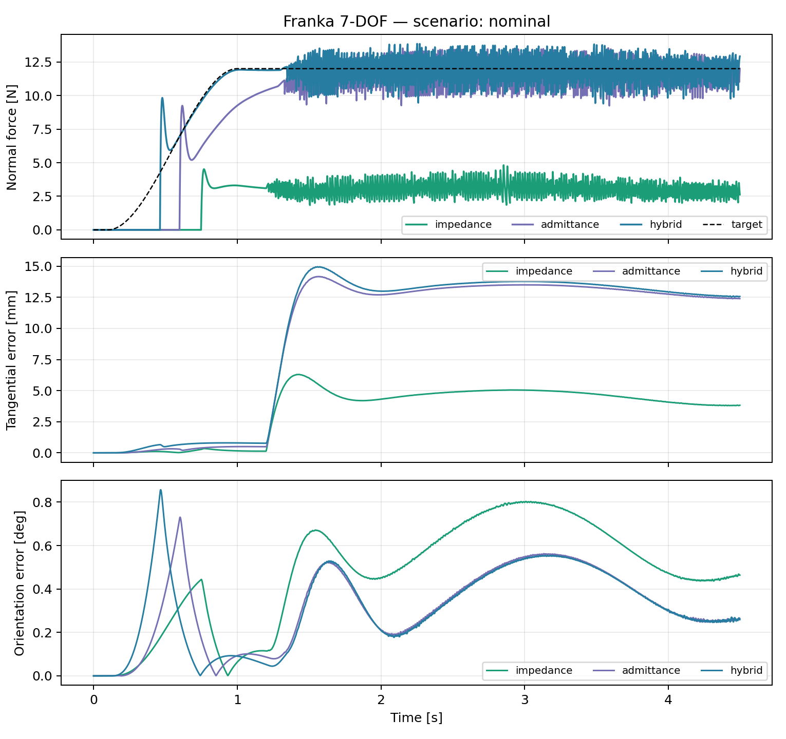

# Robot Arm Compliant Control Lab

[](https://github.com/LYHrmer/robot-arm-compliant-control-lab/actions/workflows/tests.yml)

一个可复现的 MuJoCo 机械臂接触控制项目。当前 `v0.2` 使用 Franka Panda 7-DOF
力矩模型，实现 6D 笛卡尔阻抗、导纳和力位混合控制，并在墙体刚度变化、传感器噪声及
20 ms 延迟下评估力跟踪、切向轨迹、姿态误差、关节力矩和实时性。




## 主要结果

Franka 以 500 Hz 控制末端工具维持 12 N 法向接触力，同时沿墙面执行二维擦拭轨迹。

| 控制器 | 场景 | 力 RMSE [N] | 切向 RMSE [mm] | 姿态 RMSE [deg] | 力矩饱和 |
|---|---|---:|---:|---:|---:|
| Impedance | nominal | 8.98 | 3.26 | 0.62 | 0% |
| Admittance | nominal | 0.94 | 9.29 | 0.41 | 0% |
| Hybrid | nominal | 0.91 | 9.50 | 0.40 | 0% |
| Hybrid | noisy + 20 ms delay | 0.93 | 8.70 | 0.41 | 0% |

阻抗控制不显式跟踪 12 N，因此接触峰值较低但力误差最大；导纳和力位混合控制的力跟踪
更准确，但刚性墙场景的原始接触峰值更高。指标没有用滤波掩盖冲击：`force_rmse_n`
来自低通后的传感器反馈，`peak_force_n` 来自 MuJoCo 原始接触力。

完整结果见 [Franka metrics](results/franka/metrics.md)。

## 实现内容

- Franka Panda 7-DOF 官方几何、惯量和关节限制。
- 7 个关节力矩执行器、重力/科氏偏置补偿。
- MuJoCo 计算的 `6×7` geometric Jacobian。
- 6D 末端位置与姿态阻抗。
- 法向导纳外环和笛卡尔位置内环。
- 法向力 PI 与切向位置 PD 的混合控制。
- 阻尼零空间投影和关节姿态目标。
- 接触感知 anti-windup、力传感器低通、噪声与延迟注入。
- 关节力矩限幅、饱和率和控制器 P95 耗时统计。
- 20 个运动学、控制器和 MuJoCo 闭环测试。

控制公式和实现对应关系见 [Franka 7-DOF control notes](docs/franka_control.md)。

## 快速开始

```bash
python3 -m venv .venv
source .venv/bin/activate
pip install -e ".[dev]"

pytest
franka-control-lab --output results/franka --gif
```

快速验证单个控制器：

```bash
franka-control-lab \
  --controllers hybrid \
  --duration 2.5 \
  --output results/franka-quick
```

无显示器的 Linux 环境可显式指定 EGL：

```bash
MUJOCO_GL=egl franka-control-lab --output results/franka --gif
```

## 实验场景

1. `nominal`：标称接触参数和低噪声力反馈。
2. `stiff_wall`：更短的接触时间常数，用于测试碰撞峰值。
3. `noisy_delay`：0.5 mm 位置噪声、0.6 N 力噪声和 20 ms 测量延迟。

每组实验使用相同初始状态、参考轨迹和随机种子。机器人先接近墙面，然后在 y-z 平面执行
圆形擦拭运动。完整命令一次运行 3 个控制器 × 3 个场景并生成 CSV、Markdown、PNG 和 GIF。

## 项目结构

```text
src/compliant_control_lab/
├── assets/
│   ├── franka_scene.xml
│   ├── franka_emika_panda/   # 官方模型、许可证与 torque derivative
│   └── planar_arm.xml
├── franka_control.py         # 6D impedance/admittance/hybrid controllers
├── franka_simulation.py      # 7-DOF dynamics, contact and metrics
├── franka_experiments.py     # Franka benchmark CLI
├── franka_plotting.py        # plots and MuJoCo renderer
├── controllers.py            # 2-DOF pedagogical baseline
└── simulation.py
tests/
docs/
results/
```

## 2-DOF 教学基线

原始 2-DOF 平面机械臂实验仍然保留，用于验证解析 FK、IK、Jacobian 以及控制器最小实现：

```bash
compliant-control-lab --output results --gif
```

对应推导见 [2-DOF control notes](docs/control_theory.md)。

## 模型来源与许可证

Franka 模型来自 Google DeepMind
[MuJoCo Menagerie](https://github.com/google-deepmind/mujoco_menagerie/tree/main/franka_emika_panda)，
固定到上游 commit `da76818e269b82289eba39808e2fb91d679d6994`。模型资源使用 Apache-2.0，
许可证和修改说明保存在
[`assets/franka_emika_panda`](src/compliant_control_lab/assets/franka_emika_panda/UPSTREAM.md)。
本项目其余代码使用 MIT License。

## 已知局限

- 使用理想力矩接口，没有模拟电流环、编码器量化和通信抖动。
- 接触参数是 MuJoCo 参数，不是真机辨识结果。
- 零空间投影是阻尼运动学投影，不是完整 operational-space inertia formulation。
- 尚未包含 ROS2 realtime controller、watchdog 和真机碰撞安全状态机。

## 下一步

- C++17/Eigen 控制器与 Python 参考实现一致性测试。
- ROS2 controller、实时线程、watchdog 和配置 YAML。
- 用 Pinocchio 交叉验证 Jacobian、重力补偿和 operational-space dynamics。
- 软垫、刚性墙和曲面上的 Sim-to-Real 参数辨识。

