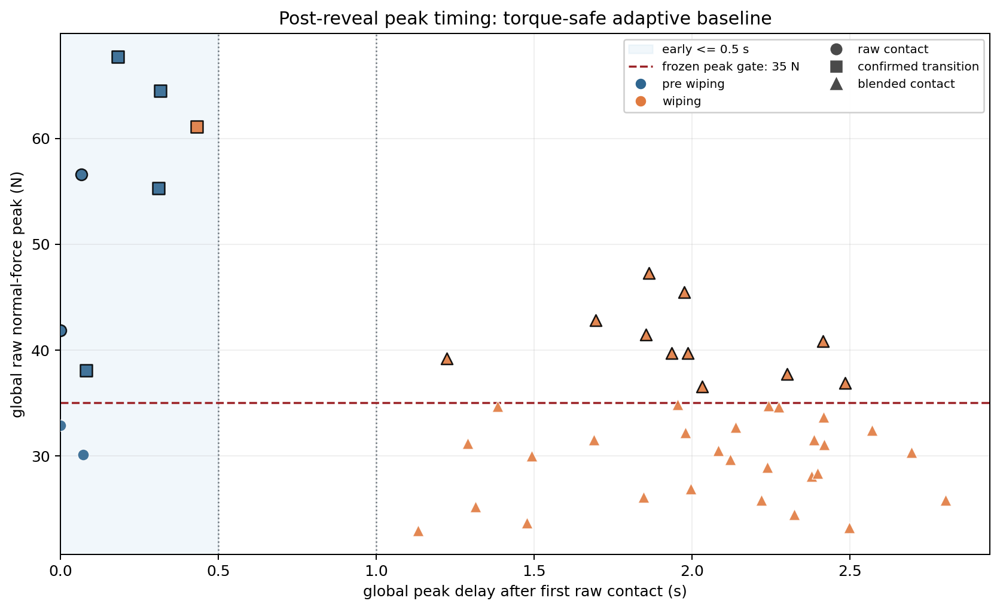

# Robot Arm Compliant Control Lab

[](https://github.com/LYHrmer/robot-arm-compliant-control-lab/actions/workflows/tests.yml)

Franka Panda 7-DOF 在 MuJoCo 中以 500 Hz 维持 12 N 法向接触力，同时沿墙面执行擦拭轨迹。
仓库从固定增益基线开始，随后加入自适应柔顺控制。Bounded Residual RL 只修正经典控制器
留下的误差。每次实验的预注册条件和完整产物都保留在仓库，失败 case 不删除。

冻结的 v0.5 已完成 48-case first reveal。关节力矩投影把 torque-safe 方法的最差 actuator
saturation 降到 0%，但五个 residual 只通过 22–26/48，未达到 44/48，结论为 `FAIL`。
完整轨迹 raw peak P95 是 59.54 N；揭盲后的事件重放显示，超限峰值分布在入触初段和擦拭
阶段，不能全部归因于首次接触。所有 checkpoint 仅供仿真研究，禁止直接用于真机。

仓库软件版本是 0.5.1；冻结实验的协议身份仍是 v0.5，已有结果没有重算或改名。

v0.6 的开发实验已加入分步采样和有状态接近参考。四组对照分别检查采样时序、解析速度参考
与参考限速的影响，继续使用已公开场景，保留 v0.5 的 `FAIL`。实现和复现命令见
[接近参考与采样时序](docs/reference_governor_v0.6.md)。
同分步时序下，原始参考、解析速度和限速参考分别通过 23、24、23/48；限速参考目前只作为
实验选项，[192 次仿真结果](results/franka_reference_ablation/summary.md) 已保留。

后续开发已加入[表面坐标控制与工具端六维 F/T](docs/surface_frame_and_sensing.md)。
独立的 24-case 开发网格比较世界坐标控制与法向标定偏差；任务和指标定义有变化，
结果不与旧 holdout 混算。代表轨迹保存完整控制输入，可逐步重放 wrench 和关节力矩。
这轮 96 次仿真中，准确法向组的切向误差配对中位数降低 0.66 mm，但四组真实接触比例
中位数都约 57%，持续接触问题尚未解决。[完整结果](results/franka_surface_development/summary.md)
使用未滤波力指标，不能与旧版滤波力 RMSE 直接比较。

## v0.5 首次揭盲结果

机器人使用相同的 48 个仿真参数场景和相同的逐 case 噪声 seed。预注册规则要求五个 residual
策略分别达到 44/48，不能挑最好 seed 或改用平均通过率。

| 方法 | 通过数 | Force-tracking error P95 [N] | Raw peak P95 [N] | Tangent P95 [mm] | Saturation worst |
|---|---:|---:|---:|---:|---:|
| Fixed hybrid | 17/48 | 2.01 | 58.62 | 22.66 | 19.69% |
| Adaptive hybrid | 23/48 | 2.21 | 58.99 | 18.89 | 20.71% |
| Torque-safe adaptive | 24/48 | 2.33 | 59.54 | 18.89 | 0.00% |
| Torque residual（5 runs） | 22–26/48 | 1.98–2.12 | 59.54 | 15.98–16.50 | 0.00% |

`Force-tracking error` 在进入稳定任务阶段后由滤波力反馈计算；`Raw peak` 取完整轨迹中的未滤波
最大接触力，包含首次碰撞。表中的约 2 N 稳态误差和约 60 N 瞬时峰值并不矛盾。

主结果是 `FAIL`。Residual policy 改善了切向跟踪，torque projection 也完成了限幅职责；
完整轨迹的 raw-force peak 仍然超过 35 N gate。仓库保留这一结果，不部署策略，也不把训练
回报当作安全证据。

同 case 配对后，五个 residual 分别在 34–35/48 个场景中降低 tangent RMSE，中位降幅为
1.47–2.09 mm；force RMSE 中位增加 0.05–0.11 N，raw peak 中位增加 0.36–0.59 N。
即使在揭盲后省略 peak-force gate，五个策略也只有 40–41/48，仍低于 44/48。这些数字
属于公开数据的描述性分析，不计作新的 blind evidence。

原始 384 行数据在 [comparison.csv](results/franka_safety_blind/comparison.csv)，生成摘要在
[summary.md](results/franka_safety_blind/summary.md)。冻结、信标和结果哈希见
[v0.5 protocol](docs/reproduction_plan_v0.5.md)。全部版本的假设与结论集中在
[experiment record](docs/experiments/README.md)。


上图只使用揭盲后已经公开的数据。它解释失败来源，不构成一轮新的 blind evaluation；
生成方法和逐项计数见 [post-reveal summary](results/franka_safety_postreveal/summary.md)。



第二张图重放 torque-safe adaptive 的 48 个公开 case。生成器先核对冻结指标，再按峰值距首次
raw contact 的时间作图；颜色表示运动阶段，形状表示 controller contact phase。事件定义和
两簇峰值的数值见 [contact-event diagnosis](docs/contact_event_diagnosis.md)。

## 核心实现入口

| 问题 | 代码 | 怎么检查 |
|---|---|---|
| 500 Hz 接触状态机与经典柔顺控制 | [`franka_control.py`](src/compliant_control_lab/franka_control.py)、[`franka_control.cpp`](cpp/src/franka_control.cpp) | [controller tests](tests/test_franka_control.py)、[fixed-controller parity](tests/test_cpp_parity.py) |
| 在线 bias/刚度估计与 gain scheduling | [`franka_adaptive.py`](src/compliant_control_lab/franka_adaptive.py) | [adaptive tests](tests/test_franka_adaptive.py)、[48-case event replay](results/franka_safety_postreveal/contact_events/summary.md) |
| 有状态接近参考与因果力反馈 | [`franka_reference.py`](src/compliant_control_lab/franka_reference.py)、[split-step simulation](src/compliant_control_lab/franka_simulation.py) | [参考约束](tests/test_franka_reference.py)、[采样契约](tests/test_franka_timing.py)、[四组实验](docs/reference_governor_v0.6.md) |
| 表面坐标、工具端 F/T 与完整输入回放 | [`surface_control.py`](src/compliant_control_lab/surface_control.py)、[`surface_sensing.py`](src/compliant_control_lab/surface_sensing.py)、[`surface_replay.py`](src/compliant_control_lab/surface_replay.py) | [坐标与传感器教程](docs/surface_frame_and_sensing.md)、[因果采样测试](tests/test_surface_simulation.py) |
| 6D wrench 到 7 关节力矩包络投影 | [Python](src/compliant_control_lab/franka_torque_safety.py)、[C++17](cpp/src/torque_safety.cpp) | [native edge cases](cpp/tests/test_torque_safety.cpp)、[160-case randomized parity](tests/test_cpp_parity.py) |
| 50 Hz bounded residual 与 500 Hz safety wrapper | [`residual_rl.py`](src/compliant_control_lab/residual_rl.py) | [residual tests](tests/test_residual_rl.py)、[paired effect](results/franka_safety_postreveal/summary.md) |
| 五 seed 冻结、first reveal 与离线复核 | [`franka_safety_learning.py`](src/compliant_control_lab/franka_safety_learning.py)、[`published_results_audit.py`](src/compliant_control_lab/published_results_audit.py) | [protocol tests](tests/test_franka_safety_learning.py)、[tamper tests](tests/test_published_results_audit.py) |

## 实现范围

控制路径从 2-DOF 解析模型开始，随后进入 Franka 6D Cartesian wrench 控制：

- impedance、admittance 和 hybrid force-position control；
- bias/force-rate/contact-stiffness estimator 与 gain scheduling；
- contact confirmation、force transition、anti-windup 和 reference governor；
- nominal wrench 与 residual wrench 的两级 joint-torque projection；
- 50 Hz、三轴有界 residual policy，外层仍由 500 Hz 经典控制器运行。

实验路径使用独立 train/development 数据、五个训练 seed、冻结 tag、SHA256 manifest，以及
未来 drand Quicknet round 生成首次揭盲场景。架构和数据流见
[architecture](docs/architecture.md)。

### Python / C++ 范围

| 能力 | Python | C++17/Eigen | 公开实验 |
|---|---:|---:|---:|
| Impedance / admittance / fixed hybrid | 是 | 是，逐分量 parity | nominal、v0.3、v0.4、v0.5 |
| Adaptive gain scheduling | 是 | 否 | v0.4、v0.5 |
| Torque projection / residual headroom | 是 | 是，160-case parity | v0.5 rollout 使用 Python；C++ port 为揭盲后工程验证 |
| Bounded Residual RL | 是 | 否 | v0.4、v0.5 |
| ROS 2 / Franka hardware adapter | 否 | 否 | 无 |

C++ 核心的接口只包含固定尺寸状态、目标和 Cartesian wrench。完整的主张、测试和结果对应关系
见 [verification matrix](docs/verification_matrix.md)。

## 从哪里开始读

| 目标 | 阅读入口 |
|---|---|
| 五分钟核验项目 | [招聘方走查](docs/recruiter_walkthrough.md)、本页结果、[架构图](docs/architecture.md) |
| 系统学习柔顺控制 | [教程目录](docs/tutorial/README.md)，从 2-DOF 一直读到 Franka 与 Residual RL |
| 检查算法和数值实现 | [Franka control notes](docs/franka_control.md)、[torque-safe residual notes](docs/torque_safe_residual_v0.5.md) |
| 学习接触峰值怎么定位 | [contact-event diagnosis](docs/contact_event_diagnosis.md)、[48-case CSV](results/franka_safety_postreveal/contact_events/safe_adaptive_contact_events.csv) |
| 审核实验可信度 | [v0.5 protocol](docs/reproduction_plan_v0.5.md)、[manifest](results/franka_safety_blind/manifest.json) |
| 准备面试 | [练习、故障定位和项目表达](docs/tutorial/06_exercises_and_interview.md) |

完整导航和术语说明分别在 [docs/README.md](docs/README.md) 与
[CONTEXT.md](CONTEXT.md)。

## 安装后快速复核

需要 Python 3.10+。MuJoCo 仿真不要求 ROS 2 或 Franka hardware interface。

```bash
git clone https://github.com/LYHrmer/robot-arm-compliant-control-lab.git
cd robot-arm-compliant-control-lab
python3 -m venv .venv
source .venv/bin/activate
pip install -e ".[dev]"

franka-smoke
```

该命令先校验 384 行冻结归档，再运行 2 s torque-safe adaptive nominal 仿真。正常输出会同时保留
实验失败和工程检查通过这两个状态：

```text
archive: PASS (384 rows, frozen_decision=FAIL)
simulation: PASS (safe_adaptive_hybrid/nominal, steps=1000, ...)
smoke: PASS
```

`smoke: PASS` 不会把冻结结论改成通过，也不等于重跑 48 cases。CI 使用同一个入口。

## 标称演示

```bash
franka-control-lab --output results/franka-quick --gif
```


这个 GIF 只展示 fixed hybrid 的 nominal 动作；v0.5 residual 结果见前面的冻结表和诊断图。

无显示器的 Linux 环境可指定 EGL：

```bash
MUJOCO_GL=egl franka-control-lab --output results/franka-quick --gif
```

2-DOF 教学基线：

```bash
compliant-control-lab --output results/planar-quick --gif
```

## 验证代码

Python 测试和静态检查：

```bash
pytest
ruff check src tests
```

C++17/Eigen 核心及 Python/C++ 数值一致性：

```bash
cmake -S . -B build -DCMAKE_BUILD_TYPE=Release
cmake --build build --parallel
ctest --test-dir build --output-on-failure
pytest tests/test_cpp_parity.py
./build/compliant_control_torque_benchmark
```

离线审核仓库中已经发布的 v0.5 产物，不联网，也不重新运行仿真：

```bash
franka-published-results-audit \
  --protocol results/franka_safety_preholdout/protocol.json \
  --result results/franka_safety_blind
```

该命令先核对固定的 v0.5 manifest 与 `COMPLETE` 标记，再检查文件 hash、两路 beacon 归档、
blind root 与 HMAC seed 推导、384 行 case-method 网格、policy 身份、gate 标签和 summary
通过数。它不联网，也不重新执行 BLS 验签或仿真；BLS 校验记录已包含在固定 manifest 覆盖的
`reveal.json` 中。`audit PASS` 表示发布归档未变且内部推导自洽；冻结的实验结论仍然是 `FAIL`。

完整训练、公开验证和新一轮 first-reveal 命令放在
[实验复现文档](docs/reproduction_plan_v0.5.md)，避免把一次正式实验误当成快速示例运行。

## 项目结构

```text
src/compliant_control_lab/
├── franka_control.py          # fixed 6D Cartesian controllers and state interface
├── franka_adaptive.py         # estimators, gain scheduling and torque-safe adaptive nominal
├── franka_torque_safety.py    # wrench-to-joint-torque projection
├── residual_rl.py             # observation, policy and residual safety rules
├── franka_learning.py         # ARS training and 24-case public validation
├── franka_safety_learning.py  # five-seed freeze and 48-case first reveal
├── franka_simulation.py       # MuJoCo adapter, contact task and metrics
├── contact_event_analysis.py  # verified event replay of public v0.5 cases
├── post_reveal_analysis.py    # paired effects and gate sensitivity
├── smoke.py                   # archive + short simulation check
└── controllers.py             # 2-DOF teaching baseline
cpp/
├── include/                   # public fixed-size Eigen interface
├── src/                       # fixed controllers and torque-envelope projection
└── tests/                     # native behavior tests and parity probe
docs/                          # navigation, tutorials, method notes and experiment records
results/                       # committed CSV, figures, policies and integrity manifests
tests/                         # math, controller, simulation, safety and protocol tests
```

## 当前限制

- 仿真使用理想力矩接口，没有电流环、编码器量化和真实通信抖动。
- 接触参数直接取自 MuJoCo，未做真机辨识。
- 零空间投影采用阻尼运动学形式，尚未实现 dynamically consistent operational-space control。
- C++ 覆盖固定经典控制器和 torque projection/headroom。Adaptive scheduling 与 reference
  governor 仍在 Python；policy 和训练也未移植。
- torque projection 没有提供 torque-rate、碰撞阈值或硬件安全认证。
- 当前机器没有 Franka hardware/model interface，仓库不声称完成 ros2_control 真机插件。

## 下一项实验

事件重放先逐 case 核对 7 个冻结指标，再读取峰值时刻的 controller 与 actuation telemetry。
48/48 case 的最大指标误差为 0。18 个 peak-gate
failure 中，7 个峰值位于首次 raw contact 后 0.432 s 内；另外 11 个在 1.222 s 以后达到
峰值。独立的 motion-phase 统计为 pre-wiping 6 / wiping 12。

下一轮会把问题拆开：入触 cohort 比较较低能量的 approach/reference governor，擦拭 cohort
检查在接触运动中的法向速度和 wrench 调节。现有 48 cases 只用于生成假设；新的最终结论
需要冻结 v0.6 协议并使用未来 beacon。

现有 failure breakdown 与 event replay 可用下面的命令重新生成：

```bash
franka-post-reveal-analysis
franka-contact-event-analysis
```

## 模型与许可证

Franka 模型来自 Google DeepMind
[MuJoCo Menagerie](https://github.com/google-deepmind/mujoco_menagerie/tree/main/franka_emika_panda)，
固定到上游 commit `da76818e269b82289eba39808e2fb91d679d6994`。模型资源使用 Apache-2.0，
许可证和修改说明保存在
[assets/franka_emika_panda](src/compliant_control_lab/assets/franka_emika_panda/UPSTREAM.md)。
本项目其余代码使用 MIT License。
