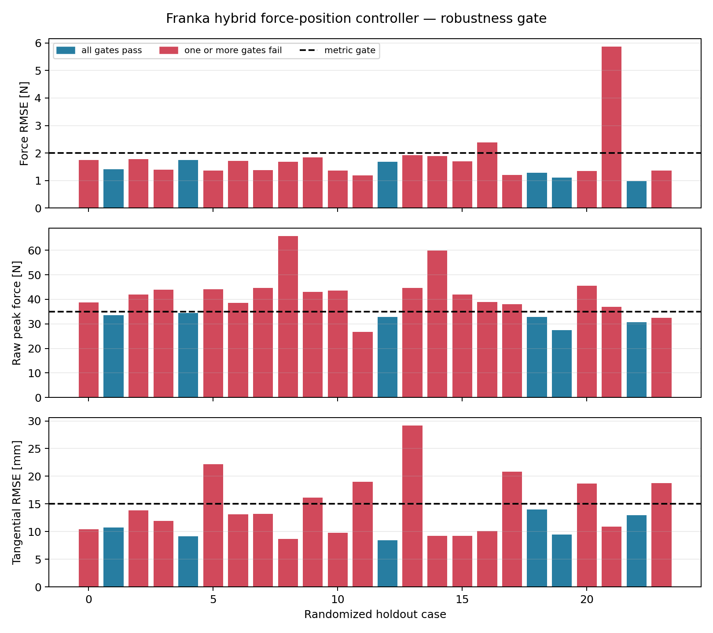

# Robot Arm Compliant Control Lab

[](https://github.com/LYHrmer/robot-arm-compliant-control-lab/actions/workflows/tests.yml)

一个可复现的 MuJoCo 机械臂接触控制项目。当前 `v0.3` 使用 Franka Panda 7-DOF
力矩模型，实现 6D 笛卡尔阻抗、导纳和力位混合控制；新增 C++17/Eigen 控制核心、
Python/C++ 数值一致性测试，以及用于决定是否引入 Residual RL 的随机失配压力测试。




## 主要结果

Franka 以 500 Hz 控制末端工具维持 12 N 法向接触力，同时沿墙面执行二维擦拭轨迹。

| 控制器 | 场景 | 力 RMSE [N] | 切向 RMSE [mm] | 姿态 RMSE [deg] | 力矩饱和 |
|---|---|---:|---:|---:|---:|
| Impedance | nominal | 8.98 | 3.26 | 0.62 | 0% |
| Admittance | nominal | 0.94 | 9.29 | 0.41 | 0% |
| Hybrid | nominal | 0.95 | 9.55 | 0.40 | 0% |
| Hybrid | noisy + 20 ms delay | 0.95 | 8.75 | 0.41 | 0% |

阻抗控制不显式跟踪 12 N，因此接触峰值较低但力误差最大；导纳和力位混合控制的力跟踪
更准确，但刚性墙场景的原始接触峰值更高。指标没有用滤波或稳态窗口掩盖冲击：
`force_rmse_n` 来自接近结束后的低通反馈，`peak_force_n` 覆盖完整轨迹的 MuJoCo 原始
接触力（包括首次接触）。

完整结果见 [Franka metrics](results/franka/metrics.md)。

### 随机失配与 Residual RL 决策

在运行实验前固定了门槛：24 个未见工况中至少 90% 同时满足力 RMSE <= 2 N、接触率
>= 95%、原始峰值力 <= 35 N、切向 RMSE <= 15 mm、力矩饱和 <= 1%。随机范围包含
接触柔度/摩擦、墙面法向误差、传感器偏置与噪声、0--30 ms 延迟和动力学 bias 误差。

加入接触确认、低速 approach 和 150 ms 力控切换后，固定增益 hybrid 仍只通过
**6/24（25.0%）**；接触率始终为 100%，但峰值力 P95 为 57.74 N，切向 RMSE 最差
29.16 mm，力矩饱和最差 12.53%。因此下一版值得把 Residual RL 作为实验项，但应作为
有界 Cartesian wrench 残差叠加在经典控制器上，并与 adaptive-admittance classical
baseline 对比，而不是直接改成端到端关节力矩策略。完整判断、动作空间、安全约束和消融协议见
[Residual RL decision](docs/residual_rl_decision.md)。

## 实现内容

- Franka Panda 7-DOF 官方几何、惯量和关节限制。
- 7 个关节力矩执行器、重力/科氏偏置补偿。
- MuJoCo 计算的 `6×7` geometric Jacobian。
- 6D 末端位置与姿态阻抗。
- 法向导纳外环和笛卡尔位置内环。
- 法向力 PI 与切向位置 PD 的混合控制。
- 接触确认、迟滞释放、限幅 approach 和无冲击的 position-to-force 平滑切换。
- 阻尼零空间投影和关节姿态目标。
- 接触感知 anti-windup、力传感器低通、噪声与延迟注入。
- 关节力矩限幅、饱和率和控制器 P95 耗时统计。
- C++17/Eigen 固定尺寸控制核心，更新路径无日志、锁和显式堆分配。
- CTest 原生测试，以及 Python/C++ 每个 wrench 分量 `1e-12` 容差的一致性测试。
- 24 个固定 holdout 随机失配工况和预先声明的 Residual RL go/no-go 门槛。

控制公式和实现对应关系见 [Franka 7-DOF control notes](docs/franka_control.md)。

## 学习路线：从入门到进阶

项目保留 2-DOF 解析模型建立直觉，再逐步进入 Franka 6D 控制、数值线性代数、C++ 实时
实现和 Residual RL 实验设计。完整教程从
[学习路线总览](docs/tutorial/README.md) 开始：

1. [2-DOF FK、IK、Jacobian 与奇异性](docs/tutorial/01_2dof_kinematics.md)
2. [阻抗、导纳、力位混合与接触状态机](docs/tutorial/02_compliant_control.md)
3. [Franka wrench-to-torque、阻尼伪逆与 null space 解算](docs/tutorial/03_franka_numerics.md)
4. [指标、随机 holdout 与可信实验方法](docs/tutorial/04_experiments_and_validation.md)
5. [Residual RL 动作、奖励、安全层与消融协议](docs/tutorial/05_residual_rl.md)
6. [分级练习、故障定位和面试表达](docs/tutorial/06_exercises_and_interview.md)

每章都给出公式的离散实现、源码入口、验证命令和练习，不要求先会 ROS 2 或真机开发。

## 快速开始

```bash
python3 -m venv .venv
source .venv/bin/activate
pip install -e ".[dev]"

pytest
franka-control-lab --output results/franka --gif
```

C++17/Eigen 控制核心：

```bash
cmake -S . -B build -DCMAKE_BUILD_TYPE=Release
cmake --build build --parallel
ctest --test-dir build --output-on-failure
pytest tests/test_cpp_parity.py
```

重新生成随机失配压力测试：

```bash
franka-stress-lab --output results/franka_stress --cases 24 --seed 29
```

快速验证单个控制器：

```bash
franka-control-lab \
  --controllers hybrid \
  --duration 2.5 \
  --output results/franka-quick
```

无显示器的 Linux 环境可显式指定 EGL：

```bash
MUJOCO_GL=egl franka-control-lab --output results/franka --gif
```

## 实验场景

1. `nominal`：标称接触参数和低噪声力反馈。
2. `stiff_wall`：更短的接触时间常数，用于测试碰撞峰值。
3. `noisy_delay`：0.5 mm 位置噪声、0.6 N 力噪声和 20 ms 测量延迟。

每组实验使用相同初始状态、参考轨迹和随机种子。机器人先接近墙面，然后在 y-z 平面执行
圆形擦拭运动。完整命令一次运行 3 个控制器 × 3 个场景并生成 CSV、Markdown、PNG 和 GIF。

## 项目结构

```text
src/compliant_control_lab/
├── assets/
│   ├── franka_scene.xml
│   ├── franka_emika_panda/   # 官方模型、许可证与 torque derivative
│   └── planar_arm.xml
├── franka_control.py         # 6D impedance/admittance/hybrid controllers
├── franka_simulation.py      # 7-DOF dynamics, contact and metrics
├── franka_experiments.py     # Franka benchmark CLI
├── franka_plotting.py        # plots and MuJoCo renderer
├── franka_stress.py          # randomized holdout and Residual RL gate
├── controllers.py            # 2-DOF pedagogical baseline
└── simulation.py
cpp/
├── include/                  # public C++17/Eigen interface
├── src/                      # controller implementation
├── tests/                    # native CTest suite
└── tools/                    # deterministic Python parity probe
tests/
docs/
results/
```

## 2-DOF 教学基线

原始 2-DOF 平面机械臂实验仍然保留，用于验证解析 FK、IK、Jacobian 以及控制器最小实现：

```bash
compliant-control-lab --output results --gif
```

对应推导见 [2-DOF control notes](docs/control_theory.md)。

## 模型来源与许可证

Franka 模型来自 Google DeepMind
[MuJoCo Menagerie](https://github.com/google-deepmind/mujoco_menagerie/tree/main/franka_emika_panda)，
固定到上游 commit `da76818e269b82289eba39808e2fb91d679d6994`。模型资源使用 Apache-2.0，
许可证和修改说明保存在
[`assets/franka_emika_panda`](src/compliant_control_lab/assets/franka_emika_panda/UPSTREAM.md)。
本项目其余代码使用 MIT License。

## 已知局限

- 使用理想力矩接口，没有模拟电流环、编码器量化和通信抖动。
- 接触参数是 MuJoCo 参数，不是真机辨识结果。
- 零空间投影是阻尼运动学投影，不是完整 operational-space inertia formulation。
- C++ 核心已经独立可编译，但尚未接入 `franka_semantic_components`、真机 watchdog 和
  碰撞安全状态机；当前机器没有安装 Franka hardware/model 接口，不能声称完成真机插件。
- Residual RL 当前完成了需求门槛和实验设计，尚未训练或宣称优于 classical baseline。

## 下一步

- 有界 Cartesian wrench Residual RL，采用独立训练/holdout 域和五组消融。
- 安装 Franka ROS2 model interface 后实现 ros2_control controller、watchdog 和配置 YAML。
- 用 Pinocchio 交叉验证 Jacobian、重力补偿和 operational-space dynamics。
- 软垫、刚性墙和曲面上的 Sim-to-Real 参数辨识。
