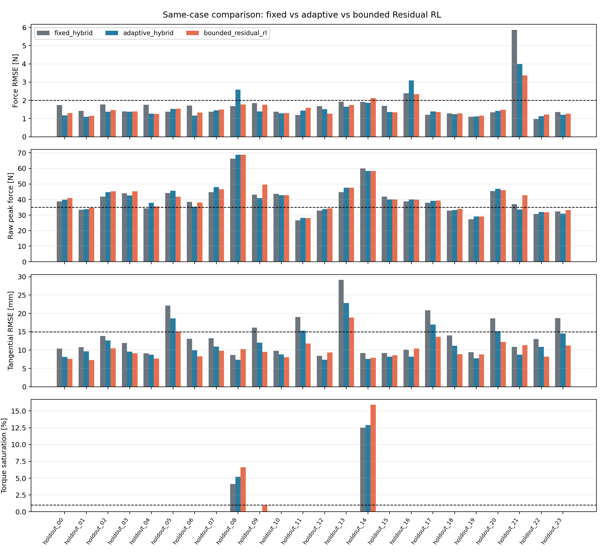

# Robot Arm Compliant Control Lab

[](https://github.com/LYHrmer/robot-arm-compliant-control-lab/actions/workflows/tests.yml)

一个可复现的 MuJoCo 机械臂接触控制项目。当前 `v0.5` 使用 Franka Panda 7-DOF
力矩模型，实现 6D 笛卡尔阻抗、导纳、力位混合、自适应增益调度和 torque-aware bounded
Residual RL。仓库同时保留 C++17/Eigen 控制核心、Python/C++ 数值一致性测试，以及从
公开验证集到五 seed / 48-case first reveal 的实验记录。




## 主要结果

Franka 以 500 Hz 控制末端工具维持 12 N 法向接触力，同时沿墙面执行二维擦拭轨迹。

| 控制器 | 场景 | 力 RMSE [N] | 切向 RMSE [mm] | 姿态 RMSE [deg] | 力矩饱和 |
|---|---|---:|---:|---:|---:|
| Impedance | nominal | 8.98 | 3.26 | 0.62 | 0% |
| Admittance | nominal | 0.94 | 9.29 | 0.41 | 0% |
| Hybrid | nominal | 0.95 | 9.55 | 0.40 | 0% |
| Hybrid | noisy + 20 ms delay | 0.95 | 8.75 | 0.41 | 0% |

阻抗控制不显式跟踪 12 N，所以接触峰值较低但力误差最大；导纳和力位混合控制的力跟踪
更准确，但刚性墙场景的原始接触峰值更高。指标没有用滤波或稳态窗口掩盖冲击：
`force_rmse_n` 来自接近结束后的低通反馈，`peak_force_n` 覆盖完整轨迹的 MuJoCo 原始
接触力（包括首次接触）。

完整结果见 [Franka metrics](results/franka/metrics.md)。

### 随机失配与 Residual RL

v0.3 首次运行前固定了门槛：24 个工况中至少 90% 同时满足力 RMSE <= 2 N、接触率
>= 95%、原始峰值力 <= 35 N、切向 RMSE <= 15 mm、力矩饱和 <= 1%。v0.4 沿用这套
对策略训练未见的冻结工况；由于既往结果已经公开，它被准确标为 public holdout，而不是
blind test。随机范围包含接触柔度/摩擦、墙面法向误差、传感器偏置与噪声、0--30 ms
延迟和动力学 bias 误差。

加入接触确认、低速 approach 和 150 ms 力控切换后，固定增益 hybrid 仍只通过
**6/24（25.0%）**。v0.4 随后实现了自适应经典基线和 bounded Residual RL，并在同一
24 cases、同一 simulation seeds 下比较：

| 方法 | 通过数 | Force P95 [N] | Raw peak P95 [N] | Tangent P95 [mm] | Saturation worst |
|---|---:|---:|---:|---:|---:|
| Fixed hybrid | 6/24 | 2.32 | 57.79 | 21.98 | 12.53% |
| Adaptive hybrid | 6/24 | 3.01 | 56.80 | 18.42 | 12.89% |
| Bounded Residual RL | 7/24 | 2.30 | 57.04 | 14.80 | 15.91% |

v0.4 residual 把切向 P95 降到 14.80 mm，但只增加一个通过 case，最差力矩饱和还升到
15.91%。这个 checkpoint 没达到 22/24 门槛，禁止用于真机。完整估计器、增益调度、ARS
更新和逐项失败记录见
[Adaptive compliance and bounded Residual RL](docs/adaptive_residual_rl.md)。

v0.5 先修正这个失败点：控制器拿到 `J`、bias/null-space torque 和 actuator limits 后，
先投影完整名义 wrench，再用剩余力矩余量投影 residual；策略输入加入 `+x/-x/+y/-y/+z/-z`
六个方向的可用余量。公开 seed-29 验证集上，safe adaptive 为 7/24，force P95
3.12 N、raw peak P95 58.14 N、tangent P95 18.42 mm，最差饱和从 12.89% 降到 0%。
Actuator clipping 已降到 0%，力和轨迹 gate 仍未通过。

五个 ARS seed、开发集 checkpoint selection、新 48-case first reveal 和 drand 验签流程见
[v0.5 reproduction protocol](docs/reproduction_plan_v0.5.md)；projection 推导和源码阅读顺序见
[torque-safe residual notes](docs/torque_safe_residual_v0.5.md)。

## 实现内容

- 控制：Franka 7-DOF torque model、`6×7` Jacobian、bias compensation、阻尼 null space，
  以及 impedance、admittance、hybrid force-position 和 adaptive gain scheduling。
- 接触与安全：接触确认/释放、anti-windup、传感器低通与延迟、reference governor、完整
  wrench 与 residual 的 joint-torque ray projection、10% torque reserve 和 fail-closed 回退。
- 学习：50 Hz `3×20` 线性 `tanh` residual policy、500 Hz nominal loop、五 seed ARS、
  独立 train/development/blind seed、动作幅值/速率/force guard/deadline 限制。
- 验证：C++17/Eigen 固定尺寸核心、Python/C++ `1e-12` parity、逐 case CSV、物理 gate、
  冻结 tag、SHA256 manifest 和双 relay drand BLS 验签。

控制公式和实现对应关系见 [Franka 7-DOF control notes](docs/franka_control.md)。

## 阅读顺序

项目先用 2-DOF 解析模型解释运动学和接触控制，再进入 Franka 6D 解算、C++ 实现、实验
拆分和 Residual RL。导航页在 [教程目录](docs/tutorial/README.md)：

1. [2-DOF FK、IK、Jacobian 与奇异性](docs/tutorial/01_2dof_kinematics.md)
2. [阻抗、导纳、力位混合与接触状态机](docs/tutorial/02_compliant_control.md)
3. [Franka wrench-to-torque、阻尼伪逆与 null space 解算](docs/tutorial/03_franka_numerics.md)
4. [指标、随机 holdout 与可信实验方法](docs/tutorial/04_experiments_and_validation.md)
5. [Residual RL 动作、奖励、安全层与消融协议](docs/tutorial/05_residual_rl.md)
6. [分级练习、故障定位和面试表达](docs/tutorial/06_exercises_and_interview.md)

公式、源码入口和验证命令放在同一章；不要求先会 ROS 2 或真机开发。

## 快速开始

```bash
python3 -m venv .venv
source .venv/bin/activate
pip install -e ".[dev]"

pytest
franka-control-lab --output results/franka --gif
```

C++17/Eigen 控制核心：

```bash
cmake -S . -B build -DCMAKE_BUILD_TYPE=Release
cmake --build build --parallel
ctest --test-dir build --output-on-failure
pytest tests/test_cpp_parity.py
```

重新生成随机失配压力测试：

```bash
franka-stress-lab --output results/franka_stress --cases 24 --seed 29
```

从零训练 residual policy，并对三种方法运行同一 24-case 比较：

```bash
franka-learning-lab --output results/franka_learning
```

只复评仓库中的冻结 checkpoint：

```bash
franka-learning-lab \
  --policy results/franka_learning/policy.json \
  --output results/franka_learning_eval
```

v0.5 的 first-reveal 流程需要 Node.js 18+ 来运行官方 drand 客户端：

```bash
npm ci
franka-safety-learning-lab prepare \
  --output results/franka_safety_preholdout \
  --beacon-round <至少领先当前 Quicknet 201 轮，且训练后仍满足该条件> \
  --jobs 5

# 提交上述目录并创建 v0.5-preholdout tag；信标发布后才运行：
franka-safety-learning-lab evaluate \
  --protocol results/franka_safety_preholdout/protocol.json \
  --output results/franka_safety_blind
```

`evaluate` 会检查当前 `HEAD`、tag 中每个文件的字节和全部 hash；直接指向另一个 protocol
或改过的 policy 会被拒绝。`prepare` 训练前后都用双 relay 验签轮次判断 10 分钟窗口，不依赖
本机时钟。轮次计算、冻结顺序和重试规则写在
[v0.5 protocol](docs/reproduction_plan_v0.5.md)。

快速验证单个控制器：

```bash
franka-control-lab \
  --controllers hybrid \
  --duration 2.5 \
  --output results/franka-quick
```

无显示器的 Linux 环境可显式指定 EGL：

```bash
MUJOCO_GL=egl franka-control-lab --output results/franka --gif
```

## 实验场景

1. `nominal`：标称接触参数和低噪声力反馈。
2. `stiff_wall`：更短的接触时间常数，用于测试碰撞峰值。
3. `noisy_delay`：0.5 mm 位置噪声、0.6 N 力噪声和 20 ms 测量延迟。

每组实验使用相同初始状态、参考轨迹和随机种子。机器人先接近墙面，然后在 y-z 平面执行
圆形擦拭运动。完整命令一次运行 3 个控制器 × 3 个场景并生成 CSV、Markdown、PNG 和 GIF。

## 项目结构

```text
src/compliant_control_lab/
├── assets/
│   ├── franka_scene.xml
│   ├── franka_emika_panda/   # 官方模型、许可证与 torque derivative
│   └── planar_arm.xml
├── franka_control.py         # 6D impedance/admittance/hybrid controllers
├── franka_simulation.py      # 7-DOF dynamics, contact and metrics
├── franka_experiments.py     # Franka benchmark CLI
├── franka_plotting.py        # plots and MuJoCo renderer
├── franka_stress.py          # randomized holdout and Residual RL gate
├── franka_adaptive.py        # bias/stiffness estimation and gain scheduling
├── franka_torque_safety.py   # wrench/residual to joint-torque projection
├── residual_rl.py            # policy, observation and hard residual safety envelope
├── franka_learning.py        # ARS training and same-case comparison
├── franka_safety_learning.py # five-seed freeze and 48-case first reveal
├── controllers.py            # 2-DOF pedagogical baseline
└── simulation.py
cpp/
├── include/                  # public C++17/Eigen interface
├── src/                      # controller implementation
├── tests/                    # native CTest suite
└── tools/                    # deterministic Python parity probe
tests/
docs/
results/
```

## 2-DOF 教学基线

原始 2-DOF 平面机械臂实验仍然保留，用于验证解析 FK、IK、Jacobian 以及控制器最小实现：

```bash
compliant-control-lab --output results --gif
```

对应推导见 [2-DOF control notes](docs/control_theory.md)。

## 模型来源与许可证

Franka 模型来自 Google DeepMind
[MuJoCo Menagerie](https://github.com/google-deepmind/mujoco_menagerie/tree/main/franka_emika_panda)，
固定到上游 commit `da76818e269b82289eba39808e2fb91d679d6994`。模型资源使用 Apache-2.0，
许可证和修改说明保存在
[`assets/franka_emika_panda`](src/compliant_control_lab/assets/franka_emika_panda/UPSTREAM.md)。
本项目其余代码使用 MIT License。

## 已知局限

- 使用理想力矩接口，没有模拟电流环、编码器量化和通信抖动。
- 接触参数是 MuJoCo 参数，不是真机辨识结果。
- 零空间投影是阻尼运动学投影，不是完整 operational-space inertia formulation。
- C++ 核心已经独立可编译，但尚未接入 `franka_semantic_components`、真机 watchdog 和
  碰撞安全状态机；当前机器没有安装 Franka hardware/model 接口，不能声称完成真机插件。
- 线性 ARS 是可检查的安全基线，不代表 SAC/TD3 或非线性策略的上限。
- torque projection 约束仿真中的关节力矩区间，但没有 torque-rate、碰撞阈值和硬件安全认证。
- v0.4 checkpoint 会增加个别峰值力和力矩饱和；所有已训练 checkpoint 都禁止直接上真机。

## 下一步

- 根据 v0.5 五 seed first reveal 的逐 case 失败项决定是否继续 Residual RL。
- 若继续，在相同 observation、action bounds 和 rollout 预算下比较线性 ARS、SAC 与 TD3。
- 安装 Franka ROS2 model interface 后实现 ros2_control controller、watchdog 和配置 YAML。
- 用 Pinocchio 交叉验证 Jacobian、重力补偿和 operational-space dynamics。
- 软垫、刚性墙和曲面上的 Sim-to-Real 参数辨识。
