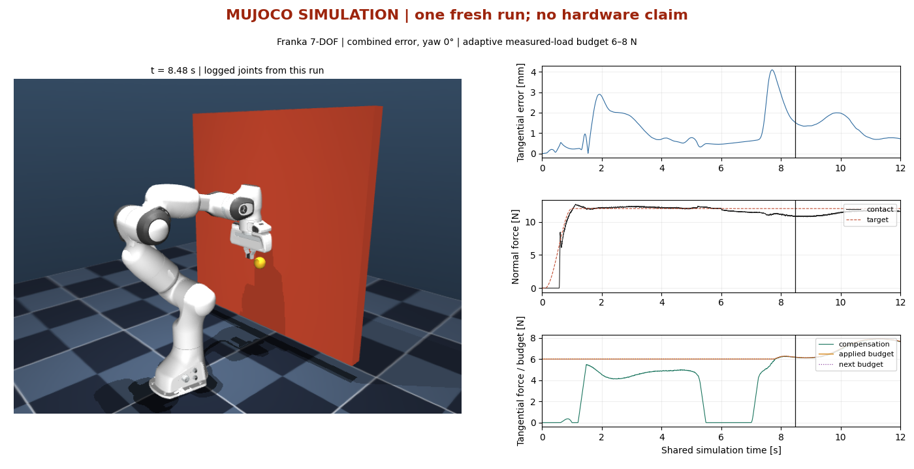

# Robot Arm Compliant Control Lab

[](https://github.com/LYHrmer/robot-arm-compliant-control-lab/actions/workflows/tests.yml)

Franka Panda 7-DOF 在 MuJoCo 中沿表面擦拭，同时跟踪 12 N 法向接触力。
项目包含 500 Hz 柔顺控制、在线切向补偿、Python/C++ 数值对齐，以及独立的 BC/PPO
训练、NumPy 推理和离线仿真验收。当前范围是仿真，没有 ROS 2 / Franka 真机接口。

| 现在想做什么 | 从这里开始 |
|---|---|
| 安装并确认控制器能运行 | [快速复核](#安装后快速复核) |
| 运行 BC/PPO，检查模型是否达标 | [部署与一键验收](docs/learning_deployment.md) |
| 从头复现训练、选模和验收 | [学习实验复现指南](docs/learning_reproduction.md) |
| 学习控制公式、诊断 BC 闭环问题 | [教程](docs/tutorial/README.md)、[BC 反馈实验](docs/tutorial/labs/04_bc_feedback.md) |
| 修改代码或找某轮实验 | [项目结构与修改落点](docs/project_structure.md)、[文档导航](docs/README.md) |

## 当前负载调度演示



[12 秒同步视频](results/franka_measured_budget_demo/demo.mp4)按同一条仿真日志重放七轴动作、
切向误差、原始接触力和补偿预算，保留约 8 s 的误差尖峰。这是一个组合误差 case，
显式启用 6–8 N 负载调度；默认配置仍是固定 6 N、姿态增益 1、速度误差时间系数 0.05 s。
单个演示不能代替多工况回归。

安装后，在仓库根目录重做演示（需要 `ffmpeg`，输出目录须不存在）：

```bash
MUJOCO_GL=egl python -m tools.diagnostics.render_measured_budget_demo --output /tmp/compliant-control-measured-demo-01
```

### 当前结果速览

| 能力 | 已验证的结果 | 证据范围 |
|---|---|---|
| 在线切向补偿 | 相对固定前馈，切向 RMSE 中位数 1.885 → 1.359 mm | [原公开 24-case、4.5 s 配对回归](docs/online_compensation.md) |
| 测得负载调度 | 27 次仿真，组合误差采用检查 7/8 | [幅值低估 20% 时失败](docs/measured_budget_robustness.md)，默认仍为固定 6 N |
| Python/C++ 移植 | 168,000 周期对齐，最大分量误差 < 3.56e-15 | [同输入数值回放](docs/cpp_core.md)，含重复演示，不证明真机实时性 |
| BC/PPO 部署 | 两策略均达标；BC 最差切向 RMSE 11.494 → 2.162 mm，安装版 16 回合通过 | [当前发行与完整门槛](docs/learning_deployment.md)，[复现方法](docs/learning_reproduction.md)；单训练种子 |

历史冻结 v0.5 的 48-case 首次揭盲仍为 `FAIL`；最新换向恢复候选的扩大回归也仍为
`FAIL`（32/36）。它们与当前 BC/PPO 部署是不同实验。达标不等于跨种子优于解析前馈。
当前范围与未解决项见[项目状态](docs/project_status.md)，五分钟走查见[招聘方入口](docs/recruiter_walkthrough.md)。

## 安装后快速复核

需要 Python 3.10+。复现发布数值采用 Linux x86_64 和
[`environment/python-version`](environment/python-version)中固定的 Python；
[环境说明](docs/reproducible_environment.md)记录依赖哈希、CPU 要求及学习依赖。

```bash
git clone https://github.com/LYHrmer/robot-arm-compliant-control-lab.git
cd robot-arm-compliant-control-lab
python3.10 -m venv .venv-repro
source .venv-repro/bin/activate
unset PYTHONPATH
export OPENBLAS_CORETYPE=Haswell OPENBLAS_NUM_THREADS=1 OMP_NUM_THREADS=1
python tools/ci/install_locked.py --profile core
python -m tools.ci.check_replay_kernel
franka-smoke
```

后续命令均在仓库根目录执行。旧摘要精确复核要求单线程 Haswell 数值内核，CPU 需支持
AVX2/FMA3；清空 `PYTHONPATH` 避免 ROS 或旧包路径混入新环境。
`franka-smoke` 校验 384 行冻结归档，再运行 2 s torque-safe adaptive nominal 仿真：

```text
archive: PASS (384 rows, frozen_decision=FAIL)
simulation: PASS (safe_adaptive_hybrid/nominal, steps=1000, ...)
smoke: PASS
```

`smoke: PASS` 表示最短工程检查通过，不重跑 48 cases，也不改变冻结失败结论。

<details>
<summary>其他 Python 版本或平台：兼容性试用</summary>

在独立环境中安装范围依赖；这种方式不保证精确复现已发布数值：

```bash
python3 -m venv .venv
source .venv/bin/activate
pip install -e ".[dev]"
franka-smoke
```

</details>

已有本地离线发行目录时，可直接执行 `./scripts/accept_learning_release.sh`。
新 clone 不包含 `dist/`；请先按[复现指南](docs/learning_reproduction.md)准备发行目录，
或完整复制部署页指定的离线包。训练需要 CPU PyTorch，安装版验收只使用 NumPy。

## 结果与决定

各轮冻结条件、数值和采用决定集中在[实验总账](docs/experiments/README.md)。
当前学习部署的训练来源、哈希与验收报告另见[部署记录](docs/learning_deployment.md)。

<details>
<summary>阅读历史结果前，先区分数据身份与保留的失败</summary>

| 实验 | 数据身份与结论 |
|---|---|
| [在线补偿](docs/online_compensation.md) | 原公开 24-case、4.5 s 回归；另有 12 s 动态误差实验，不能合并通过数 |
| [预算转移](docs/budget_transfer.md)与[测量鲁棒性](docs/measured_budget_robustness.md) | public24 兼容 23/48、鲁棒性采用检查 7/8；保留速度代价和幅值低估反例 |
| [换向恢复](docs/reversal_recovery_transfer.md)、[静止回退](docs/stationary_recovery_pilot.md)、[可逆回退](docs/reversible_recovery.md) | 分别为 34/36、3/4、32/36，整体均 `FAIL`；局部改善不构成推广依据 |
| [BC/PPO 历史试验](docs/surface_learning_pilot.md)、[BC 输入消融](docs/bc_closed_loop_transfer.md)、[BC 到 PPO 迁移](docs/bc_to_residual_rl.md) | 12 s 任务，24 个公开 case 按物理组分为 16 train / 4 validation / 4 development test；没有跨种子一致超过解析前馈的证据 |
| [冻结 v0.5 首次揭盲](results/franka_safety_blind/summary.md) | 五个 residual 策略为 22–26/48，未达到各 44/48；384 行原数据和 `FAIL` 保留 |

重复训练种子不增加独立场景数。BC 模仿补偿，PPO 在已有摩擦前馈上学残差，名义控制器
不同，不能交换动作或 checkpoint。v0.5 揭盲后的分析属于公开数据诊断，不回写首次结论；
详见[接触峰值诊断](docs/contact_event_diagnosis.md)与[冻结协议](docs/reproduction_plan_v0.5.md)。

</details>

## 算法与源码入口

| 修改目标 | 主要落点 |
|---|---|
| 500 Hz 接触控制与在线补偿 | [`surface_control.py`](src/compliant_control_lab/surface_control.py)、[`tangential_compensation.py`](src/compliant_control_lab/tangential_compensation.py) |
| 49 维观测、任务时序和教师数据 | [`surface_env.py`](src/compliant_control_lab/surface_env.py)、[`surface_dataset.py`](src/compliant_control_lab/surface_dataset.py) |
| BC/PPO 训练与模型契约 | [`tools/`](tools/)，按[学习链路地图](docs/project_structure.md#学习与部署链路)定位 trainer、actor 与 evaluator |
| 一键准备、打包和验收 | [`tools/learning_deployment/`](tools/learning_deployment/)，用户入口为 `python -m tools.learning_deployment` |
| C++ 控制核心与数值对齐 | [`cpp/`](cpp/)、[移植与验证说明](docs/cpp_core.md) |

完整目录职责和“改哪里、查什么”见[项目结构](docs/project_structure.md)。控制数据流见
[系统架构](docs/architecture.md)，每项主张对应的源码、测试和产物见[验证矩阵](docs/verification_matrix.md)。

## 标称演示

[标称动作 GIF](results/franka/hybrid_demo.gif)展示 fixed hybrid nominal。
安装后可生成 Franka 或 2-DOF 演示；每次使用新的输出目录：

```bash
franka-control-lab --output /tmp/compliant-control-franka-quick --gif
compliant-control-lab --output /tmp/compliant-control-planar-quick --gif
```

无显示器 Linux 可加 `MUJOCO_GL=egl`。这些命令只运行标称场景，完整实验复现按各自协议执行。

## 学习与导航

从[教程目录](docs/tutorial/README.md)学习公式；用四份练习检查是否真正理解实现：

1. [误差到关节力矩](docs/tutorial/labs/01_wrench_to_torque.md)：手算 wrench 与 `J.T @ wrench`。
2. [预算下降与缺包](docs/tutorial/labs/02_budget_drop.md)：核对目标上限、限速输出和下一拍状态。
3. [换向恢复故障分析](docs/tutorial/labs/03_reversal_recovery.md)：解释局部改善与扩大回归失败。
4. [BC 离线误差与闭环反馈](docs/tutorial/labs/04_bc_feedback.md)：理解输入掩码、选模和完整验收。

想复现完整 BC/PPO 流程，直接使用[学习实验复现指南](docs/learning_reproduction.md)。
查算法、历史实验或设计取舍用[文档导航](docs/README.md)，术语见 [CONTEXT.md](CONTEXT.md)。

## 验证代码

以下命令使用固定环境；完整学习测试还需[CPU 学习依赖](docs/reproducible_environment.md)。
Python/C++ 测试检查实现，`*-audit` 只核对旧归档，模型是否达标由独立闭环验收回答。

```bash
pytest
ruff check src tests tools
cmake -S . -B build -DCMAKE_BUILD_TYPE=Release
cmake --build build --parallel
ctest --test-dir build --output-on-failure
pytest tests/test_cpp_parity.py
```

两条只读复核命令保留原判定，不重新仿真：

```bash
franka-published-results-audit \
  --protocol results/franka_safety_preholdout/protocol.json \
  --result results/franka_safety_blind
python -m tools.audit_velocity_evidence
```

前者核对 v0.5 冻结归档，后者覆盖预算转移、速度代价分解、内部观测和时间系数四项实验。
`audit PASS` 不代表实验通过。完整范围见[归档复核说明](docs/velocity_evidence_audit.md)与
[招聘方走查](docs/recruiter_walkthrough.md#3-跑最短检查约-1-分钟)。

## 当前限制

MuJoCo 使用理想力矩接口，接触参数未做真机辨识；命令限幅和仿真门槛不保证真实接触力或
硬件安全。C++ 只移植选定的控制计算，不含训练、传感器采集或真实通信；零空间投影采用
阻尼运动学形式。负载调度、预算转移与恢复候选的已知失败及采用范围统一记录在
[项目状态](docs/project_status.md#当前失败与后续边界)。

## 模型与许可证

Franka 模型来自 Google DeepMind
[MuJoCo Menagerie](https://github.com/google-deepmind/mujoco_menagerie/tree/main/franka_emika_panda)，
固定于上游 commit `da76818e269b82289eba39808e2fb91d679d6994`，使用 Apache-2.0；
见[资源与修改说明](src/compliant_control_lab/assets/franka_emika_panda/UPSTREAM.md)。
本项目其余代码使用 [MIT License](LICENSE)。
