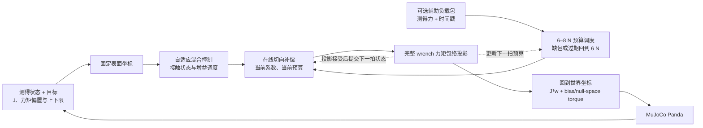
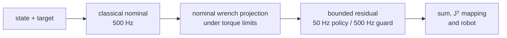
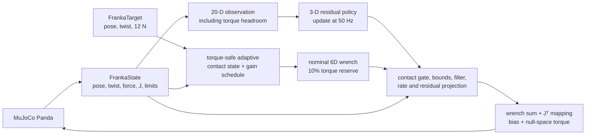
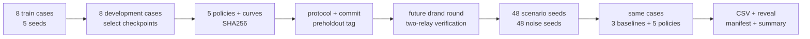

# 系统架构

当前主线是 500 Hz 表面柔顺控制与在线切向补偿，BC/PPO 保留为研究支线。
本仓库只讨论 Franka 七轴仿真及控制计算；六轴机械臂在独立项目开发。

| 路线 | 入口与用途 | 数据身份 |
|---|---|---|
| 当前控制主线 | [在线补偿](online_compensation.md)；可显式开启[测得负载预算](load_budget.md) | 原公开 24-case 回归、后续动态与测量误差实验 |
| 当前学习支线 | [49 维表面任务](surface_learning.md)、[BC/PPO 小规模训练](surface_learning_pilot.md) | 24 个公开 case 按物理任务组划分为 train/validation/development_test（16/4/4 case），不是盲测 |
| 历史 v0.5 | [20 维残差策略与首次揭盲](../results/franka_safety_blind/summary.md) | 8 train、8 development，冻结后首次揭盲 48 case；结论 `FAIL` |

后两条路线的观测、任务域与策略产物不同，不能互换 checkpoint，也不能把通过数拼在一起。
当前 BC/PPO 尚未跨种子一致超过解析前馈，首页的在线补偿成绩不来自神经网络。

## 实时控制

这里的“实时控制”指按 2 ms 仿真步更新的算法结构，不表示已经在真机上达到硬实时。
以 `online` 模式为例，一拍经过以下控制链：

在线补偿根据位置和速度误差调整等效负载系数，不读取仿真真实摩擦系数。
当前拍先用旧系数和当前预算生成力，经过 20 N/s 向量限速，再随完整 wrench 做投影。
运动确认满足且投影没有缩小请求时，才允许提交下一拍参数。

预算默认固定 6 N；姿态增益为 1，速度误差时间系数为 0.05 s。
6–8 N 调度需显式启用，Python 实验实现位于 `tools/`，C++ 有对应可选接口。
辅助包只影响切向负载估计，原法向力反馈另行提供。缺包或包龄超过 20 ms 时，负载估计清零，
预算回到 6 N；输出仍遵守原限速，短时可能高于刚下降的目标预算。
这不等于整个力传感器断开后仍能控力，见[缺包小实验](tutorial/labs/02_budget_drop.md)。

投影使用当前 Jacobian、bias/null-space torque 和关节上下限，保留 10% 力矩余量。
MuJoCo 的 actuator clipping 作为额外监测项，不能代替投影。
命令限幅没有证明接触力有界或系统被动性。

### C++ 覆盖到哪里

[`SurfaceAdaptiveController`](../cpp/src/surface_control.cpp)已覆盖表面坐标变换、
自适应混合控制与在线补偿，包括可选负载调度、测量包检查和完整 wrench 投影。
它输出 wrench 与状态；[回放程序](../cpp/tools/surface_controller_probe.cpp)再使用执行器上下文计算七轴力矩。

[当前回放](../results/franka_measured_budget_cpp_replay/report.json)包含 28 条输入轨迹、
168,000 个周期：9 个场景 × 3 种预算方法共 27 次仿真，另加一份重复演示。
它核对状态、wrench 和七轴力矩的数值移植，最大 C++ 分量误差小于 `3.56e-15`。
28 条轨迹不等于 28 个独立物理场景，也不是用 C++ 重新积分动力学。
硬件通信与操作系统调度不在验证范围内；本仓库没有真机部署结果。
构建入口和计时边界见 [C++ 核心说明](cpp_core.md)。

## 模块接口与边界（seam）

| 接口 | 负责什么 | 实现 |
|---|---|---|
| `FrankaController.compute(state, target, dt) -> wrench_6d` | Cartesian 控制公式不依赖 MuJoCo 对象 | [`franka_control.py`](../src/compliant_control_lab/franka_control.py) |
| `SurfaceAdaptiveController` | 固定表面坐标、接近阶段、自适应状态与补偿模式 | [`surface_control.py`](../src/compliant_control_lab/surface_control.py)、[`franka_adaptive.py`](../src/compliant_control_lab/franka_adaptive.py) |
| `TangentialCompensation` / `LoadAwareCompensation` | 等效负载更新；可选测得负载预算 | [`tangential_compensation.py`](../src/compliant_control_lab/tangential_compensation.py)、[`load_aware_compensation.py`](../tools/load_aware_compensation.py) |
| 测量包适配器 | 只从测量值与时间戳构造辅助输入 | [`load_budget_inputs.py`](../tools/load_budget_inputs.py)；C++ 包检查在 surface 控制入口内 |
| `FrankaActuationContext` | 传入 `J`、torque offset 和上下限；`joint_torque(wrench)` 做映射 | [`franka_control.py`](../src/compliant_control_lab/franka_control.py)；投影见 [Python](../src/compliant_control_lab/franka_torque_safety.py) / [C++](../cpp/src/torque_safety.cpp) |
| `SurfaceLearningEnv` / `SurfaceResidualController` | 49 维观测、50 Hz 策略和 500 Hz 命令保护 | [`surface_env.py`](../src/compliant_control_lab/surface_env.py)、[`surface_policy.py`](../src/compliant_control_lab/surface_policy.py) |
| 辅助负载通道审计 | 重算测量包接受、在线系数和预算，核对补偿请求；不重算完整名义控制器或七轴力矩 | [`measured_budget_validation.py`](../tools/measured_budget_validation.py) |
| Python/C++ 完整表面控制回放 | 从保存的输入重算表面控制状态、完整 wrench 与七轴力矩；不重新积分动力学 | [`verify_measured_budget_cpp.py`](../tools/verify_measured_budget_cpp.py) |

经典 impedance、admittance 和 fixed hybrid 也使用 `FrankaController`，但不自动经过自适应层。
无执行器上下文时可以查看数值 wrench，不能把它当作已经检查过力矩可行性的命令。

## 当前学习支线：49 维表面任务

`surface_env_v1` 每 2 ms 更新一次名义控制器，每 20 ms 调用一次策略，三维动作保持 10 个物理步。
接触门控与投影仍在每个物理步执行。观测包括测得运动误差和关节状态，但不含真实摩擦系数，
也不把当前动作积分后的评价真值倒填进当前策略输入。

BC 在不带摩擦前馈的自适应控制器上模仿 50 Hz 解析教师；bounded Residual PPO 则叠加在
带摩擦前馈的强基线上。把 BC 教师的输出直接叠到该强基线上会重复补偿。
12 个物理任务组按 8/2/2 划分，每组两个噪声 seed，得到 16/4/4 个公开 case。
这些是配置分组数，不是训练期间累计采样的 rollout episode 数。
观测顺序与动作单位见[学习任务](surface_learning.md)，实际成绩见[训练记录](surface_learning_pilot.md)。
这条支线没有替代上面的在线控制主线。

## 历史 v0.5：20 维残差与首次揭盲

以下保留旧实验的控制与冻结流程。20 维观测来自
[`residual_rl.py`](../src/compliant_control_lab/residual_rl.py)，不是 `surface_env_v1`。

展开历史控制周期与首次揭盲流程

### RL 改了哪里

Residual policy 不接管机器人。它只在经典控制器给出的 nominal wrench 之后添加一个三维、
有界的平移力修正；禁用策略或推理异常时，该修正回到零。

下面是旧 v0.5 控制周期的展开图：

策略每 20 ms 更新一次动作。安全 wrapper 在每个 2 ms 周期继续滤波、限速并重算 torque
projection。两次 policy update 之间的 Jacobian 变化仍会进入检查。MuJoCo 的 actuator
clipping 只保留为监测项；控制器应在到达该处以前落入预留力矩区间。

### 训练、冻结与揭盲

训练集和 development set 在冻结前可见；first-reveal cases 由冻结后才发布的随机信标派生。
揭盲后，这 48 个 cases 只能算公开验证数据。具体选择理由见
[未来信标 ADR](adr/0002-future-beacon-first-reveal.md) 和
[nominal/residual 分级投影 ADR](adr/0003-project-nominal-and-residual-separately.md)。

旧证据入口是 [`franka_safety_learning.py`](../src/compliant_control_lab/franka_safety_learning.py)
和冻结的 [protocol.json](../results/franka_safety_preholdout/protocol.json)。五个策略只通过
22–26/48，未达 44/48 门槛，首次结论仍是 `FAIL`。
后续 [事件分析](../src/compliant_control_lab/contact_event_analysis.py)可以使用这些公开 case，
但不会回写已冻结的 checkpoint 或改变它们的首次揭盲身份。

