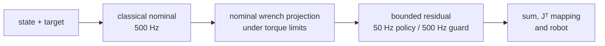
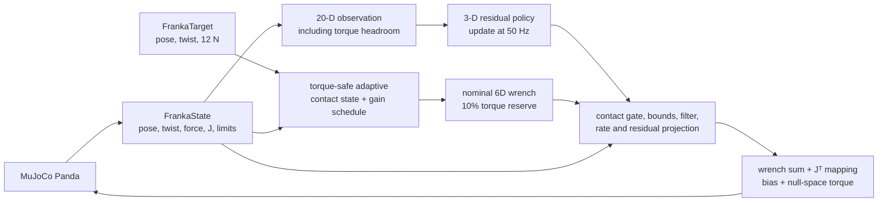
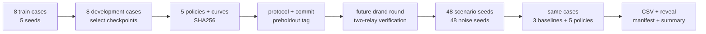

# 系统架构

## RL 改了哪里

Residual policy 不接管机器人。它只在经典控制器给出的 nominal wrench 之后添加一个三维、
有界的平移力修正；禁用策略或推理异常时，该修正回到零。

经典 impedance、admittance 和 fixed hybrid 使用同一个 `FrankaController` 接口，但不经过
自适应层或 residual policy。下面两张图再分别展开实时控制和实验证据流。

## 实时控制

策略每 20 ms 更新一次动作。安全 wrapper 在每个 2 ms 周期继续滤波、限速并重算 torque
projection。两次 policy update 之间的 Jacobian 变化仍会进入检查。MuJoCo 的 actuator
clipping 只保留为监测项；控制器应在到达该处以前落入预留力矩区间。

## 训练、冻结与揭盲

训练集和 development set 在冻结前可见；first-reveal cases 由冻结后才发布的随机信标派生。
揭盲后，这 48 个 cases 只能算公开验证数据。具体选择理由见
[未来信标 ADR](adr/0002-future-beacon-first-reveal.md) 和
[nominal/residual 分级投影 ADR](adr/0003-project-nominal-and-residual-separately.md)。

## 模块接口与边界（seam）

| 接缝 | 接口 | 当前实现 |
|---|---|---|
| Cartesian controller | `FrankaController.reset()` 与 `compute(state, target, dt) -> wrench_6d` | [`franka_control.py`](../src/compliant_control_lab/franka_control.py)；MuJoCo 对象不会穿过此接缝 |
| Actuation context | `FrankaActuationContext` 中的 `J`、torque offset 和上下限 | [`franka_simulation.py`](../src/compliant_control_lab/franka_simulation.py) 提供数据；[Python](../src/compliant_control_lab/franka_torque_safety.py) 与 [C++](../cpp/src/torque_safety.cpp) 实现投影 |
| Residual policy | `ResidualPolicy.action(observation) -> normalized_action` | [`residual_rl.py`](../src/compliant_control_lab/residual_rl.py) 保存 20-D schema，并把策略异常收敛到零 residual |
| Event telemetry | `FrankaTrialResult` 数组与可选 controller snapshot | [`contact_event_analysis.py`](../src/compliant_control_lab/contact_event_analysis.py) 先对齐冻结指标，再提取公开 case 的峰值上下文 |
| 实验证据 | `prepare` 产出冻结协议，`evaluate` 只接受与 tag 字节一致的产物 | [`franka_safety_learning.py`](../src/compliant_control_lab/franka_safety_learning.py) 和冻结的 [protocol.json](../results/franka_safety_preholdout/protocol.json) |

前两个接缝把控制公式与仿真适配器分开。策略只能添加三维 Cartesian force，无法直接写
joint torque。训练产物通过第三个接缝进入控制周期。first-reveal set 完成初次评测后可用于
post-reveal analysis，但不会回流到已经冻结的 checkpoint。
