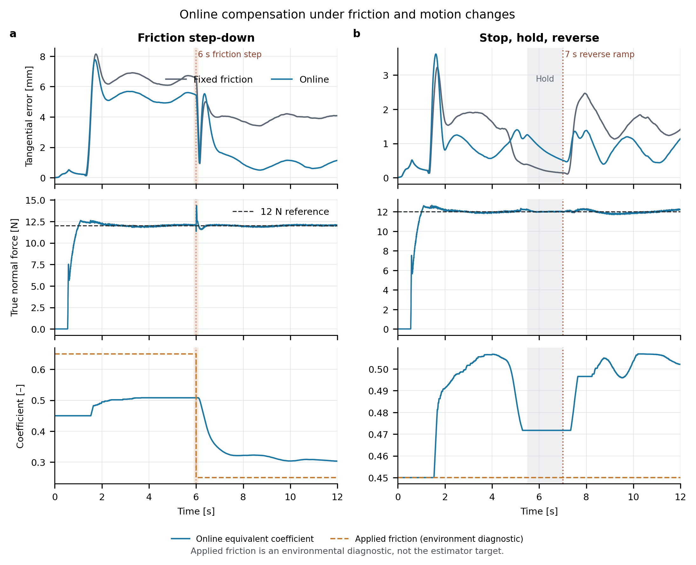

# 在线切向负载补偿

固定摩擦前馈已经能显著减小擦拭误差，但它始终使用同一个补偿系数。
这一轮保留原来的自适应法向控制，只让切向补偿强度根据运动误差缓慢更新。
新增模式叫 `online`；`integral` 和 `friction` 的计算没有改动。

本页记录原默认姿态增益的实验。后续的[姿态增益对照](rotation_gain_comparison.md)
在同一 80 次误差协议下将在线阶段通过数从 40/42 提高到 42/42；下方原始结果保持不变。

## 先看已完成的 24-case 回归

下表来自原有公开表面开发集，单次 4.5 秒，评价区间为 1.5–4.5 秒。
三个旧方法的 72 条结果与原归档逐项一致，最大指标误差为 0。

| 方法 | 切向 RMSE 中位数 [mm] | 最差 case [mm] |
|---|---:|---:|
| 自适应混合控制，无切向补偿 | 11.800 | 11.837 |
| 有界切向积分 | 8.093 | 8.159 |
| 固定摩擦前馈 | 1.885 | 1.923 |
| 在线等效负载补偿 | 1.359 | 1.391 |

在线方法在 24 个配对 case 中都降低了切向 RMSE。相对固定前馈，改善最小的 case
也减少了 0.500 mm。24/24 通过预先设定的接触、峰值力、裁剪和配对误差检查。
在线方法的全轨迹最大接触力为 12.699 N。

这里的检查要求接触率至少 99%、峰值力不超过 35 N、执行器裁剪率为 0，
法向力 RMSE 相对固定前馈增加不超过 0.2 N，姿态 RMSE 增加不超过 0.2°。
这些只是本轮仿真验收条件，不是硬件安全标准。

[配对 CSV](../results/franka_online_compensation_regression/comparison.csv)和
[完整汇总](../results/franka_online_compensation_regression/summary.json)保留了所有 case。
这是公开数据上的回归，不是新盲测。也不要将这里的 1.359 mm 与 BC/PPO 的
12 秒开发集均值直接比较：两者的时长、任务配置和汇总方式不同。

## 算法实际更新什么

设控制器使用的单位法向为 $n$，切向投影矩阵为

$$P_t=I-nn^T.$$

从测量和目标中得到切向误差及平滑运动方向：

$$
e_t=P_t(x_d-x),\quad e_v=P_t(v_d-v),\quad
s=\frac{P_t v_d}{\sqrt{\|P_t v_d\|^2+v_0^2}}.
$$

当前周期的补偿请求是

$$f_{raw}=b\,\min(\hat\mu F_n,6)\,s,$$

其中 $F_n$ 是经过现有偏置修正的压缩力测量，$b$ 是接触过渡权重。
请求随后受到 20 N/s 的向量变化率限制，再与名义 wrench 一起做力矩包络投影。

只有投影完整接受该请求，且运动条件允许时，才更新下一周期的系数：

$$
\Delta\hat\mu=\operatorname{clip}\left(
\Delta t\,\gamma\frac{F_n}{F_n^2+F_0^2}
s^T(e_t+T_v e_v),\;-r_\mu\Delta t,\;r_\mu\Delta t\right),
$$

$$\hat\mu_{k+1}=\operatorname{clip}(\hat\mu_k+\Delta\hat\mu,0,0.9).$$

默认值为 $\gamma=800$、 $F_0=2$ N、 $T_v=0.05$ s、 $r_\mu=0.3$/s，
$v_0=0.005$ m/s，初始系数为 0.45。源码和测试中的数值顺序一致：
先用旧系数生成当前力，再提交下一周期的参数，不能提前使用更新后的系数。

实现见 [`TangentialCompensation`](../src/compliant_control_lab/tangential_compensation.py)，
接入位置在 [`FrankaSafeAdaptiveController.compute`](../src/compliant_control_lab/franka_adaptive.py)。

### 为什么不直接叫“摩擦辨识”

更新律没有读取真实摩擦系数，也没有读取仿真的理想接触力。
它利用跟踪误差调整一个能改善当前任务的补偿系数。力传感器零偏或动力学误差，
也可能让这个系数发生变化。因此 `equivalent_mu` 只能解释成等效负载系数。

固定前馈、积分和在线方法都保留 6 N 上限。12 N 法向力下，系数接近 0.5 时
已经触及补偿幅值上限；真实摩擦系数为 0.65 时，在线更新也无法完整抵消摩擦。
达到该上限后禁止继续向外积累，但允许系数向回减小。

## 什么时候停止学习

| 情况 | 输出和内部状态 |
|---|---|
| 未确认接触、压缩力不超过 1 N，或目标不要求接触 | 补偿立即清零，系数重置为 0.45 |
| 接触过渡权重小于 0.99 | 可以输出平滑补偿，不更新系数 |
| 目标切向速度小于 0.005 m/s | 暂停更新，保留系数 |
| 实际运动尚未跟上目标方向、换向或请求仍在变化率限幅 | 清除运动确认计时，不更新系数 |
| 上述运动条件连续满足 50 ms | 允许进入参数更新阶段 |
| 力矩投影缩小请求、回退，或没有执行器模型上下文 | 不提交参数更新 |

接触丢失时的立即清零、参数重置，是普通变化率限制的明确例外。
没有把“上一次已经丢失接触的补偿”缓慢送进下一次入触。
反过来，这个选择也会丢失之前学到的系数；频繁离开表面时需要重新适应。

静摩擦导致工具完全不动时，运动确认条件会暂停学习。本实现并不解决所有黏滑问题。
参数和请求有界，也不构成整个机械臂接触闭环的稳定性或被动性证明。

## 运行和检查

安装仓库的开发依赖后，在仓库根目录运行：

```bash
python -m tools.online_compensation_regression --output /tmp/online-public24
pytest tests/test_online_tangential_compensation.py tests/test_tangential_replay.py
```

输出路径必须是新路径，程序不会覆盖旧实验。回归命令运行全部四种方法，
在发布新 CSV 前重新核对原有结果。

`SurfaceAdaptiveController(frame, tangential_mode="online")` 是直接调用入口。
想理解状态更新，先看单元测试中的已知数值例子，再看力矩投影拒绝、换向和接触丢失测试。
完整轨迹可以用 `replay_surface_trace` 重放；重放只核对控制计算，不重新积分机械臂动力学。

## 12 秒误差对照的设计

另一个实验固定原开发集 case 16 的几何配置，每种工况运行噪声 seed 11 和 29，
四种控制器使用同一组扰动与种子，共 80 次仿真。参数和扰动时间在运行前写入协议。
这两个种子只重复测量噪声，不代表两个独立物理场景；本实验也不是新的 holdout。

| 工况 | 预先设定的变化 |
|---|---|
| 三档固定摩擦 | 0.25、0.45、0.65 |
| 摩擦阶跃上升 / 下降 | 6 s 时，0.25 → 0.65 / 0.65 → 0.25 |
| 摩擦缓变 | 4–8 s，0.25 → 0.65 |
| 停顿换向 | 4.5–5.5 s 减速，5.5–7 s 停住，7–8 s 反向加速 |
| 力传感器偏差 | 6 s 起沿真实法向加 1.5 N 测量偏置 |
| 法向标定误差 | 控制坐标相对真实表面偏转 5° |
| 组合误差 | 摩擦 0.30 → 0.60、0.75 N 偏置、3° 标定误差及停顿换向 |

总体误差在 1.5–12 s 评价，峰值力与执行器裁剪检查完整轨迹。另按阶跃前后、
缓变中、停止和反向运动等区间分别统计，避免用一个全程均值掩盖短时退化。
本轮姿态配对门槛为增加不超过 0.1°，比上面静态回归的 0.2° 更严格；
在线控制器同时与无补偿及固定前馈比较法向力和姿态代价。

恢复时间记录事件发生后，连续 0.25 s 窗口内首次满足力误差 RMSE ≤ 1 N、
或切向误差 RMSE ≤ 3 mm 的时间。两项分别统计，未恢复如实保留。
这不是“恢复后永远不再超限”的保证，速度误差 RMS 也不是频谱或稳定性证明。

每次运行保留可重算指标的紧凑轨迹。摩擦下降和停顿换向的 seed 11，另保留固定前馈、
在线控制器的四份完整输入轨迹，用于 Python/C++ 逐周期回放。

### 实测结果与没有通过的部分

下表是两个预定噪声种子的全程切向 RMSE 均值，单位 mm。四种方法的全部 80 行结果在
[comparison.csv](../results/franka_online_compensation_errors/comparison.csv)，
168 行阶段结果在 [phase_metrics.csv](../results/franka_online_compensation_errors/phase_metrics.csv)。

| 工况 | 固定前馈 | 在线补偿 |
|---|---:|---:|
| 标称摩擦 0.45 | 1.698 | 1.059 |
| 低摩擦 0.25 | 3.876 | 1.130 |
| 高摩擦 0.65 | 6.475 | 5.354 |
| 摩擦阶跃上升 | 5.432 | 4.274 |
| 摩擦阶跃下降 | 5.227 | 3.821 |
| 摩擦缓变上升 | 4.815 | 3.643 |
| 停顿换向 | 1.524 | 1.068 |
| 力测量偏置阶跃 | 1.371 | 1.105 |
| 法向标定误差 | 2.402 | 1.743 |
| 组合误差 | 3.257 | 2.392 |

在线方法在 20 个逐种子配对中均降低全程切向 RMSE，最小改善为 0.264 mm。
这 20 次运行的评价区间接触率均为 100%，全轨迹最大接触力为 14.269 N，执行器裁剪为 0。
相对固定前馈，全程法向力 RMSE 最多增加 0.0056 N，姿态 RMSE 最多增加 0.0093°。

但不能据此说“所有阶段都通过”。在线方法的阶段检查通过 **40/42**：
两个种子的 7–8 s 反向加速段，姿态 RMSE 相对无补偿基线分别增加 0.1369°、0.1369°，
超过预设的 0.1°。固定前馈在同一阶段也增加约 0.118°，同样未通过；
在线方法相对固定前馈又增加约 0.019°。这说明当前切向补偿仍有短时姿态代价。
全部方法合计有 12 条阶段检查失败，原表均保留。

高摩擦阶跃与缓变上升后，两个种子的切向误差都没有恢复到预设的 3 mm 窗口阈值。
摩擦下降后则分别在 0.538 s、0.544 s 首次达到该阈值。力偏置实验中的“力恢复时间 0”
只表示事件后第一个 0.25 s 窗口满足条件，不能解读为消除了后续零偏：
该工况在线控制的全程力 RMSE 仍为 1.035 N、1.046 N。



图中固定使用 seed 11，不按成绩挑种子。虚线摩擦系数是实验施加的环境量，未输入控制器，
也不是等效系数必须追踪的辨识目标。阴影分别标记摩擦阶跃和停顿区间。

独立审计重算全部紧凑轨迹的指标、阶段门槛、扰动时序和限幅，并检查重置是否确实发生在
失去接触或未完成接触过渡时。本次在线请求的常规变化率不超过 20 N/s，
系数变化率不超过 0.3/s（浮点舍入误差除外），未出现重置跳变。
审计通过表示数据与声明一致，不会把上面的阶段失败改成成功。

```bash
# 只读复核已发布的 80 次实验，不重新积分动力学
python -m tools.audit_online_compensation_errors --audit results/franka_online_compensation_errors

# 从固定协议重新运行，必须使用不存在的输出目录
python -m compliant_control_lab.online_compensation_experiment --output /tmp/online-errors-rerun
```

四份完整轨迹还通过了 [C++ 数值控制链回放](cpp_core.md#recorded-surface-loop-result)。
24,000 个周期的 wrench 分量最大差异小于 `4.45e-15`，在线系数和更新就绪状态逐步一致。
这只检查移植是否忠实；上述姿态代价不会因为换成 C++ 而消失。
