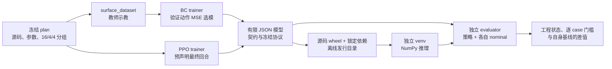

# 项目结构与修改落点

项目有两条运行路线：经典控制直接驱动 MuJoCo；学习路线在同一类表面任务上训练 BC/PPO，
导出模型后交给独立 evaluator 验收。两条路线共享控制计算与物理环境，研究协议和历史
产物分别保存。先用统一入口运行，再按下面的地图深入实现。

## 对外运行入口

| 任务 | 稳定入口 | 操作说明 |
|---|---|---|
| 最短工程检查 | `franka-smoke` | [安装与预期输出](../README.md#安装后快速复核) |
| 标称控制演示 | `franka-control-lab`、`compliant-control-lab` | [Franka／2-DOF 示例](../README.md#标称演示) |
| 训练到仿真验收 | `python -m tools.learning_deployment prepare` | [学习复现](learning_reproduction.md) |
| 安装版模型校验和运行 | `franka-learning-deploy verify/run/accept` | [离线部署](learning_deployment.md) |
| 重跑本机已交付发行版 | [`scripts/accept_learning_release.sh`](../scripts/accept_learning_release.sh) | 依赖指定的本地发行目录，Git clone 本身不含该目录 |
| 已发表实验复核 | 对应实验的 `audit` 入口 | [实验总账](experiments/README.md)、[四项速度证据复核](velocity_evidence_audit.md) |

`tools/learning_deployment` 将计划、阶段恢复、来源校验、打包和验收集中到一个入口；
用户无需手工拼接 trainer、模型文件和不同 nominal 的 evaluator。运行仍必须满足该
入口的条件：匹配的模型契约、外部预期哈希、冻结源码和新的输出目录。

## 目录职责

```text
robot-arm-compliant-control-lab/
├── src/compliant_control_lab/   # 可安装的控制、仿真、数据与策略契约
│   └── assets/                 # MuJoCo 场景、Panda 模型与上游许可
├── tools/                      # 研究协议、训练、诊断和归档复核
│   ├── learning_deployment/    # prepare / verify / run / accept / package
│   ├── ci/                     # 固定环境安装、内核检查与 CI 诊断
│   ├── tutorials/              # 教学数值例子与轨迹回放
│   └── diagnostics/            # 单因素探针和演示渲染
├── cpp/                        # 选定控制公式的 C++ 实现、探针与测试
├── tests/                      # Python 行为、契约、归档与 C++ parity 测试
├── environment/                # Python 版本、依赖锁与 runtime 子集
├── scripts/                    # 当前本地发行版的便捷验收命令
├── docs/                       # 教程、算法、复现、结构与设计决策
│   ├── experiments/            # 历史实验总账
│   ├── evidence/               # 小型交付证据与运行审计摘要
│   └── tutorial/               # 分章教学与带答案实验
├── results/                    # 已提交的实验协议、指标、轨迹与失败记录
├── dist/                       # 本地训练、wheelhouse、发行目录和安装验收（忽略）
└── build/                      # CMake 等构建产物（忽略）
```

[`pyproject.toml`](../pyproject.toml)定义 Python 包和命令，
[`CMakeLists.txt`](../CMakeLists.txt)定义 C++ 构建，
[`.github/workflows/`](../.github/workflows/)定义 CI。
根目录可能出现的 `task_plan.md`、`progress.md`、`findings.md` 是本机协作记录，
不是运行依赖或复现协议；`.venv*`、`.local-deps/` 和 `node_modules/` 也是环境目录。

## 学习与部署链路



具体实现只在负责该行为的模块内维护：

| 模块 | 主要实现 | 调用者需要知道的接口 |
|---|---|---|
| 表面学习环境 | [`surface_env.py`](../src/compliant_control_lab/surface_env.py)、[`learning_surface_task.py`](../src/compliant_control_lab/learning_surface_task.py) | 49 维观测、3 维动作、50 Hz 策略／500 Hz 控制，以及终止原因 |
| 数据与分组 | [`surface_dataset.py`](../src/compliant_control_lab/surface_dataset.py)、[`surface_splits.py`](../src/compliant_control_lab/surface_splits.py) | 同频教师标签、16/4/4 case 按物理任务组隔离 |
| BC/PPO 训练 | [`train_surface_bc.py`](../tools/train_surface_bc.py)、[`train_surface_bc_transfer.py`](../tools/train_surface_bc_transfer.py)、[`train_surface_ppo.py`](../tools/train_surface_ppo.py) | 训练配置、输入模式、检查点选择规则与训练 manifest |
| 策略契约与推理 | [`surface_policy_artifact.py`](../src/compliant_control_lab/surface_policy_artifact.py)、[`surface_mlp_actor.py`](../tools/surface_mlp_actor.py) | nominal 与动作语义必须匹配；部署加载有限 JSON，无需 Torch |
| 独立闭环评价 | [`evaluate_surface_candidate.py`](../tools/evaluate_surface_candidate.py) | 候选哈希、冻结协议和完整 case 集，输出物理指标与门槛判定 |
| 部署编排 | [`pipeline.py`](../tools/learning_deployment/pipeline.py)、[`bundle.py`](../tools/learning_deployment/bundle.py) | 完整性校验后恢复阶段；模型、cases、协议与源码身份一起绑定 |
| 离线发行与安装 | [`release.py`](../tools/learning_deployment/release.py)、[`install_release.py`](../tools/learning_deployment/install_release.py) | 按绑定 commit 构建，外部 SHA256 校验，独立环境安装和验收 |

BC 的 adaptive nominal 和 PPO 的 friction nominal 是两种独立的标称控制适配器，选择
由契约明确表达。学习策略在接收观测／输出动作的位置形成明确接口；更换适配器仍需
保留相应的观测、动作和 nominal 语义，不能只替换权重文件。

控制路线的逐拍数据流见[系统架构](architecture.md)，wrench 接口 的设计原因见
[ADR-0001](adr/0001-cartesian-wrench-controller-seam.md)。本页不重复控制公式。

## 改哪里、验证什么

| 要改的行为 | 首先修改 | 对应验证 |
|---|---|---|
| 阻抗、混合控制或在线补偿公式 | `src/compliant_control_lab/` 下对应控制模块 | 数学／状态测试；涉及已移植公式时同步 `cpp/` 并运行 parity |
| 观测、动作或 teacher 标签 | `surface_env.py`、`surface_policy.py`、`surface_dataset.py` | 数据回放与契约测试；接口变化需重做训练和导出 |
| BC 输入消融或训练选择 | `tools/train_surface_bc_transfer.py` 和部署配置 | 训练来源、导出一致性、验证集与独立闭环；保留旧失败模型 |
| 验收流程、恢复或离线安装 | `tools/learning_deployment/` | `test_learning_deployment*.py`，再在无 Torch 的新环境执行完整验收 |
| 一轮研究假设或候选控制器 | 对应 `tools/` study 与专门实验目录 | 预声明协议、同 case 对照、完整门槛和只读 audit |
| 解释、复现命令或教学 | 对应 `docs/` 页面 | 本地链接、标题锚点与实际命令；导航只链接，不复制整份结果 |

控制默认值、候选实验和已冻结结论有各自的采用条件。改代码后应生成新计划与新结果，
不要覆盖旧 manifest；源码路径也可能参与身份哈希。批量移动 `src/` 或 `tools/` 会影响
import、命令、归档校验和已发行模型，必须作为单独的兼容迁移处理。

## 结果放在哪里

| 位置 | 保存内容 | 使用方式 |
|---|---|---|
| `results/` | 已发布协议、CSV、summary、manifest 与代表轨迹 | 从[实验总账](experiments/README.md)进入；原 PASS/FAIL 和数据身份保持可追溯 |
| `docs/evidence/` | 交付摘要、来源 commit、模型／发行哈希和检查结果 | 跟随对应部署说明阅读；摘要不能替代完整轨迹 |
| `dist/learning-run-*/` | 本机计划、示教、训练阶段、bundle 和源码版验收 | 可按同一计划校验后恢复；不同参数使用新目录 |
| `dist/learning-release-*/` | 可复制的离线发行目录 | 整体搬运，以独立保存的预期哈希验真 |
| `dist/learning-*-acceptance-*/` 等新目录 | 安装版完整仿真报告 | 与源码版逐 case 比对；重跑时选择新目录 |

`dist/` 被 Git 忽略，所以仓库首页不能把本机发行脚本当成新 clone 的完整安装器。
[复现指南](learning_reproduction.md)负责从源码生成产物，
[部署说明](learning_deployment.md)记录当前可用发行目录和外部哈希。

当前整理保留物理目录与历史脚本名，通过少量入口降低查找成本。`tools/` 仍含较多按实验
命名的顶层脚本：它们有被冻结的 import 与来源关系，后续需要按实验族迁移时，应同时
提供兼容入口与来源迁移证据，不能只把文件换个文件夹。
