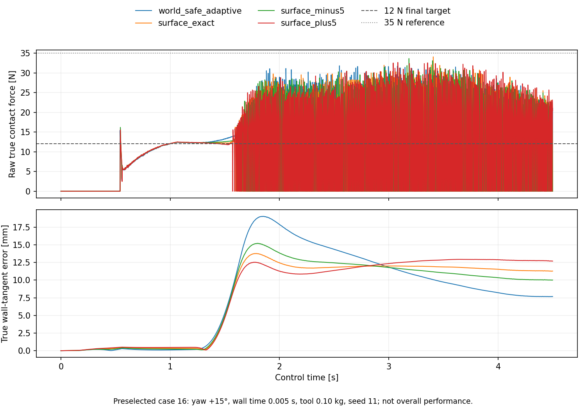

# 表面坐标系、工具端 F/T 与标定误差

旧实验中，控制器沿世界 x 轴控力、沿 y/z 轴控位。墙面转过一个角度后，这组轴就不再贴合
接触面。本轮把任务坐标和控制坐标分开，加入工具端六维力/力矩测量，检查法向标定偏差的
影响。控制器仍使用 torque-safe adaptive baseline；没有重新训练 RL。

这是独立的开发实验。它使用新的轨迹和传感器定义，不能与旧版 24-case holdout 或 v0.5
48-case first reveal 直接合表。v0.5 的 `FAIL` 保留。先看
[全部配对结果](../results/franka_surface_development/summary.md)，再按下面的公式读源码。

96 次仿真中，准确法向相对世界坐标组的切向误差配对中位数下降 0.657 mm，但接触比例的
配对中位差为 −0.967 个百分点。四组的真实接触比例中位数约 57%，仍有明显的间歇脱离。
原始力 RMSE 中位数约 11 N。这版修正了坐标表达，尚未解决持续接触问题；不要用平均力
接近 12 N 或 0% 力矩饱和代替接触稳定性结论。



上图保留了全部原始采样。四组高频力曲线会重叠，具体极值和总体对照请查 CSV；下图的
切向误差也随时间交叉，不能只选某个时刻说明哪组更好。

## 墙面转了，增益矩阵也要跟着转

令 `R = [n, t1, t2]`，三列分别为法向和两个切向在世界坐标中的单位向量。
`SurfaceFrame` 检查 `RᵀR = I` 和 `det(R) = 1`。这里所有坐标共用原点；TCP 的力矩只做
旋转，不移动力矩参考点。

对位置误差 `e` 和速度误差 `ė`，在表面坐标中计算切向阻抗：

```text
e_s = Rᵀ e
ė_s = Rᵀ ė
K_s = diag(0, k_t1, k_t2)
D_s = diag(0, d_t1, d_t2)
f_t_world = R (K_s e_s + D_s ė_s)
```

这样有 `nᵀ f_t_world = 0`。若只把误差投影到切平面，随后仍乘世界坐标的对角增益，
`diag(K) (I − nnᵀ) e` 一般会重新产生法向分量。可以用 30° 法向和一个纯切向误差自己算一次。
力位混合控制的约束方向与投影背景见
[Modern Robotics 11.6](https://modernrobotics.northwestern.edu/nu-gm-book-resource/11-6-hybrid-motion-force-control/)。

一个可手算的检查：令 `n = (√3/2, 1/2, 0)`、`t = (−1/2, √3/2, 0)`，误差 `e = 0.01t m`。
错误的世界对角增益给出 `f = (0, 3.8971, 0) N`，其中法向分量为 `1.9486 N`。
在表面坐标中计算得到 `f = (−2.25, 3.8971, 0) N`，法向分量为零。
用 `abs(n @ f) < 1e-12` 就能检查这个局部不变量，无须先跑整段仿真。

实现没有另写一份自适应算法。`SurfaceAdaptiveController` 把状态和目标旋到固定表面坐标，
调用原来的安全自适应控制器，再把输出旋回世界坐标。原来的法向 +x 在局部坐标中仍然成立。
切换到单位矩阵 `R = I` 时，测试要求与原控制器逐值一致。

Jacobian 必须同时变换。写成 `Q = blockdiag(R, R)`：

```text
J_s = Qᵀ J_world
w_world = Q w_s
τ = J_sᵀ w_s + τ_offset = J_worldᵀ w_world + τ_offset
```

关节空间的 offset 和力矩上下界不变。只转 wrench、不转用于安全投影的 Jacobian，会让
安全层检查另一组关节力矩。

代码在 [`surface_control.py`](../src/compliant_control_lab/surface_control.py)；
[测试](../tests/test_surface_control.py)包含任意三维旋转下的协变性和关节力矩不变性。
这些是坐标计算检查，不代表机器人在任意墙面角度都能稳定接触。

## 传感器到底量到了什么

新场景在 `contact_tool` 的 `ee_site` 添加 MuJoCo `force` 和 `torque` sensor。
这个 site 与工具质心重合，测的是工具与父刚体之间的相互作用，含动力学载荷。
它不是安装在手腕上的真实 F/T，也不是单独的接触力真值。
传感器定义可核对 [MuJoCo XML reference](https://mujoco.readthedocs.io/en/latest/XMLreference.html#sensor-force)。

本项目以机器人对环境施加的载荷为正。设 `S_f` 为传感器坐标中的原始力、`R_ws` 为
传感器到世界的旋转、`b_f` 和 `ε_f` 为偏置与噪声，当前力测量为：

```text
f_measured_world = R_ws (S_f + b_f + ε_f) + m_nominal g_world
τ_measured_world = R_ws (S_τ + b_τ + ε_τ)
```

静止的 0.10 kg 工具在补偿前读到世界 z 方向约 +0.981 N；加上 `m_nominal g` 后接近零。
测试还对工具施加已知外力/力矩，检查测量符号与该外载荷相反。
质心与 site 重合时，重力关于该点的力矩为零，所以这版不需要力矩臂补偿。

这里只补偿名义重力，不使用仿真真值加速度消掉惯性载荷。工具加速时即使没有接触也可能
测到非零力。换装 0.13 kg 工具、仍按 0.10 kg 补偿时，质量误差也会留下来。
不过本轮只绕世界 z 轴转墙，重力残差沿 z，不进入水平法向的力投影。
不能拿这组质量对照证明任意倾斜表面的载荷补偿鲁棒性。

六个通道都保存在日志中；当前闭环只消费 `n_calibratedᵀ f_measured_world` 这个带符号
标量。姿态仍是 PD 控制，测得的三个力矩通道暂作诊断。源码和符号测试分别在
[`surface_sensing.py`](../src/compliant_control_lab/surface_sensing.py) 与
[`test_surface_sensing.py`](../tests/test_surface_sensing.py)。

## 一个周期中，先测什么、后算什么

```text
周期 k：mj_step1 → x[k] / J[k]
                  + 上周期已转到世界坐标的 F/T[k−1]
                  → 一阶滤波 → 可选观测延迟 → controller → τ[k]
        mj_step2 → 求解 F/T[k] → 立即旋转、缓存 → 下个周期使用
```

`mj_step2` 返回后，求解出的 wrench 和缓存的 site 旋转仍属于积分前的 `x[k]`。
下一次 `mj_step1` 会更新旋转，不能等到那时再用新姿态旋转旧力。
启动时先用 reset 后的一次 forward solve 生成观测，并把第一行实际输入用于控制器 reset。

滤波形式是 `y[k] = y[k−1] + α(u[k] − y[k−1])`，`α = dt/(τ_filter + dt)`。
六维向量在世界坐标中滤波。日志中 `raw_wrench_world` 指未滤波、已补偿且已加噪声的传感器
载荷；`true_normal_force` 才是评估用的理想接触法向力。两者不能互换。

`measured_wrench_sample_time` 记录滤波器最新原始输入的时间，不表示滤波没有相位滞后。
额外 `delay_steps` 只延迟笛卡尔位姿/速度及 wrench；力矩约束使用当前关节编码器对应的
Jacobian 和 offset。这不覆盖关节编码器延迟或执行器延迟。本次固定实验令额外延迟为零。

另一个限定是动力学补偿：offset 仍来自 MuJoCo 模型的 `qfrc_bias`，默认包含实际工具质量。
质量对照考察 F/T 名义载荷补偿误差，不能宣称覆盖了未知负载的完整动力学误差。

## 四组控制共用什么

| 输入 | 由谁给出 | 本次如何使用 |
|---|---|---|
| 任务平面 `SurfaceTask` | 名义夹具描述 | 四组共享同一世界坐标轨迹；这轮假定任务平面准确 |
| 控制法向 `SurfaceFrame` | 独立标定配置 | 世界 x、准确法向、准确法向减/加 5° |
| 实际墙面 `SurfaceScenario` | 仿真模型 | 只用于物理求解和指标投影，不回填控制法向 |

准确法向组是理想标定对照，不是在线估计成果。虽然任务平面恰好与真实墙面一致，控制器
仍没有法向估计器；后续应分别扰动任务定位和控制标定。本轮只固定前者、改变后者。

24 个开发 case 是笛卡尔积：墙面 yaw `−15/0/+15°`，接触时间常数 `0.005/0.012 s`，
工具质量 `0.10/0.13 kg`，噪声 seed `11/29`。每组控制器使用同一 case 参数和相同的随机
数流。偏置与噪声在传感器坐标中添加；姿态不同会使它们在世界坐标中的方向不同。

任务先平滑接近，再以有速度渐变的相位开始擦拭，位置参考与解析速度相符。
这个新轨迹也不同于旧实验，因此世界坐标组是在新任务里的基线重跑。

指标从 1.5 s 开始计算力跟踪误差和接触率，raw peak 则覆盖整段 4.5 s。
`force_rmse_n` 使用未滤波接触力真值；切向指标为真实墙面上二维误差的欧氏长度 RMSE，
没有旧指标的按分量平均因子。`measurement_rmse_n` 比较实际输入标量与当前真实法向力，
因此也包含滤波滞后和标定方向偏差，不能解释为纯传感器噪声。

## 复现与完整输入回放

安装方式见[首页](../README.md#安装后快速复核)。在仓库根目录运行：

```bash
python -m compliant_control_lab.surface_experiment --output results/surface-local
```

输出目录必须不存在或为空，命令拒绝覆盖已有归档。先做小规模检查可以加
`--case-indices 16`，报告会标明 subset，不能当作全部 24 cases 的结果。

每次生成保存逐 case 配置和 CSV，并用 SHA256 记录源码、模型以及产物身份。
完整输入 NPZ 只保留预先选定的 case 16 的四组轨迹，case 16 是 `+15° / 0.005 s / 0.10 kg /
seed 11`。其余 case 保留参数和指标，需重新仿真得到完整轨迹；代表 case 不代替总体结论。

```python
from compliant_control_lab.surface_replay import replay_surface_trace

result = replay_surface_trace(
    "results/franka_surface_development/representative_case_16_surface_exact.npz"
)
print(result)
assert result.matches
```

回放读取完整测量状态、目标和关节力矩约束，重置有状态控制器后逐步计算，比较每个 wrench
与未裁剪的 joint torque。容差是 `1e-10`。它不积分机器人动力学，只证明“相同输入可以重现
当时的控制决策”；把旧输入交给新算法，不能据此推断新算法的闭环性能。

继续练习时，可以先把 `J_s` 错写成 `J_world`，看力矩不变性测试如何失败；再将准确法向改成
偏差 5°，检查接触率和 raw peak 是否与跟踪误差一起变化。最后给任务平面也加定位误差，
另存一份实验配置，区分任务定位问题与控制法向问题。
