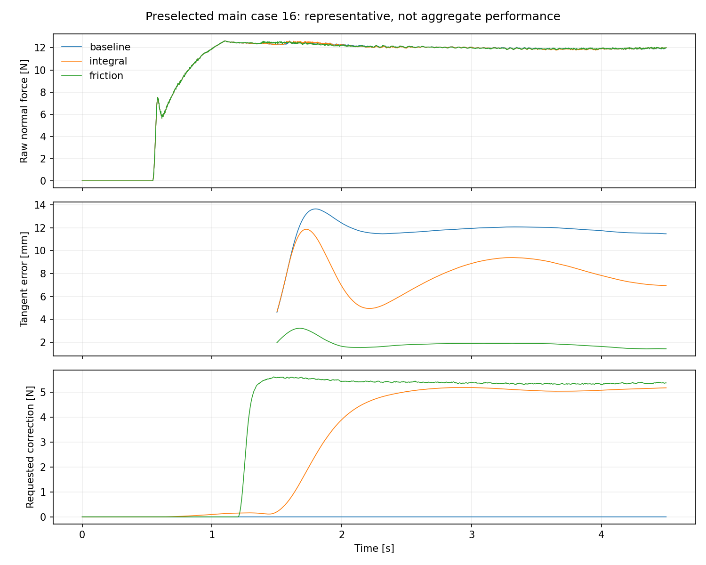
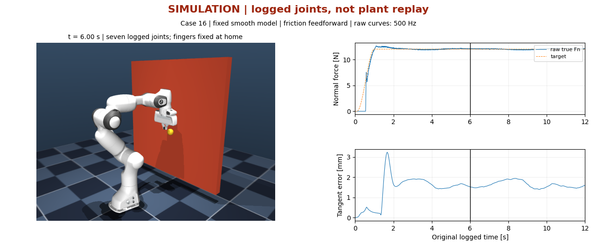

# 接触稳定以后，为什么还落后 11.8 mm

固定上一轮的平滑接触模型后，有界摩擦前馈把 24 个公开开发 case 的切向 RMSE 中位数
从 **11.800 mm 降到 1.885 mm**，约降低 84%。独立加入切向积分后是 8.093 mm，未达到
本轮预先设定的“中位误差减半”目标。两种方法都保留，不因积分结果较弱而重新调参。

这次改变的是控制器，不再改变接触柔度。三组在评估窗口均保持 100% 接触，完整轨迹均无
执行器饱和。结果适用于已知任务平面、固定平滑模型和这批公开场景；不是新的 holdout，
也不是 RL 或真机实验。完整数据见[生成摘要](../results/franka_tangential_development/summary.md)。

阅读顺序：先看误差的证据，再看两个补偿公式，最后检查完整对照与失配边界。
背景是[上一轮微分离排查](wiping_contact_diagnosis.md)；控制接口见
[表面坐标与六轴测量](surface_frame_and_sensing.md)。

## 1. 先区别负载偏差与动态滞后

预选 case 16 的旧基线在 [1.5, 4.5) s 内，沿目标运动方向的平均落后量为 11.296 mm；
1500 个采样点都在目标后方。切向接触载荷的平均模长为 5.402 N，控制器弹簧项的平均
模长为 6.074 N。实际调度后的切向刚度中位数是 516.61 N/m，不是基础参数 450 N/m。

这与“PD 控制器需要位置偏差才能产生抵抗摩擦的力”相符，但还不是因果证明。
轨迹也存在动态误差：垂直于运动方向的误差 RMSE 为 3.244 mm。两个力的**模长之差**
不能代替向量合力；把 5.4 N 除以基础刚度，也不能当作整段动态轨迹的精确推导。

因此先跑四个无噪声、无偏置、yaw=0 的 3 s 小实验。每次只改一项，RMSE 使用
[1.5, 3.0) s，peak 使用完整轨迹。

| 相对同一平滑模型基线的改动 | 切向 RMSE [mm] | Raw-force RMSE [N] |
|---|---:|---:|
| 无改动 | 11.651 | 0.224 |
| 两个接触 geom 的滑动摩擦输入设为 0 | 1.959 | 0.226 |
| 基础切向刚度翻倍，保留原调度规则 | 6.447 | 0.233 |
| 1.2 s 后轨迹时钟降为一半，解析速度同步缩放 | 9.542 | 0.192 |

去掉摩擦的变化最大，支持摩擦负载是当前误差的主要来源。减速后仍有明显偏差，不能把
问题全部归为速度参考的滞后。零摩擦只用于诊断，不是最终任务；引擎对摩擦还有内部最小
值截断，输入为零也不意味着数学上完全无摩擦。减速还改变了同一时间窗走过的路径范围，
所以这四项用于定位机制，不是公平性能排名。

脚本与原始统计分别在
[tangential_tracking_probes.py](../tools/diagnostics/tangential_tracking_probes.py) 和
[diagnosis.json](../results/franka_tangential_diagnostics/diagnosis.json)。后者保留参数、覆盖项、
源码与参考轨迹哈希，不包含七次诊断的完整原始轨迹。

## 2. 两个补偿器分别怎么算

令单位表面法向为 $n$，切向投影为 $P_t=I-nn^T$。位置误差取“目标减测量”：

$$
e_t=P_t(p_d-p),\qquad v_t=P_t v_d.
$$

补偿只增加平移 wrench 的切向分量，不直接修改法向力或姿态力矩。两种模式互斥，
本轮没有把它们叠加，也没有搜索增益。

### 切向积分：让误差逐步建立补偿力

积分状态 $z$ 的单位是 N，不是 m·s。当前周期先输出 $f_I=bz$，随后才决定是否更新
下一周期的状态：

$$
z_{k+1}=\operatorname{clip}_{\|\cdot\|\le6\,\mathrm N}
\left(z_k+K_I\Delta t\,e_{t,k}\right),\qquad
K_I=800\ \mathrm{N/(m\,s)}.
$$

这里的 $b\in[0,1]$ 是原控制器的接触过渡系数。限幅按向量模长做；若分别把两根轴
裁到 ±6 N，合力就可能超过 6 N。只有当前周期的力矩投影状态为 `unchanged` 时才提交
上述更新；投影缩放、fallback 或缺少执行器上下文时冻结积分。

这是一种条件积分的 anti-windup，加上积分状态自身的球形限幅，不是反算式 anti-windup。
确认接触丢失、校正后测量法向力 ≤1 N、目标法向力 ≤0，或者显式 reset 时，立即清空
积分状态。这样重新接触时不会带着上一次积累的切向力进入。

积分可以逐步补偿持续负载，但旋转的擦拭方向会让旧积分方向落后。本轮数据只证明这组
固定参数降低了误差，没有证明所有积分设计都不如前馈。

### 摩擦前馈：由目标速度决定方向

校正后的测量法向力记为 $\hat F_n$。本轮使用：

$$
f_{\mathrm{ff}}=
b\,\min\left(\mu_{\mathrm{nom}}\max(\hat F_n,0),F_{\max}\right)
\frac{v_t}{\sqrt{\|v_t\|^2+v_\epsilon^2}},
$$

其中 $\mu_{\mathrm{nom}}=0.45$、 $F_{\max}=6$ N、 $v_\epsilon=0.005$ m/s。
目标切向速度为零时，前馈严格为零；速度反向时连续换向，避免直接使用符号函数。
这里抵消的是**名义摩擦模型**的负载，方向来自目标速度，不是从仿真真值读取实际摩擦力。
它也不是静摩擦、Stribeck 效应或低速粘滑的完整模型。

法向力来自现有 F/T 测量、名义工具重力补偿和自适应 bias 校正；接触判定使用控制器自己的
测量状态。`true_normal_force`、`true_tangent_force_n` 与真实几何间隙只供评估。
主网格中名义摩擦恰好等于实际输入，这是一个有利先验，必须通过后面的失配实验检验边界。

两种实现都在
[`TangentialCompensation`](../src/compliant_control_lab/tangential_compensation.py)；前馈纯函数
`bounded_friction_force` 可单独测零速度、换向、旋转协变和范数上界。

## 3. 加在哪一步，才不会绕开力矩约束

每个 2 ms 周期的顺序是：

```text
因果测量 → 原自适应控制器计算一次 nominal wrench
         → 加本周期切向补偿 → 整个 nominal wrench 做一次力矩投影
         → 根据投影结果提交下一周期积分 → Jᵀw 与原 bias/null-space 项
```

入口是 [`FrankaSafeAdaptiveController.compute`](../src/compliant_control_lab/franka_adaptive.py)。
不能先投影原控制器，再在投影结果外追加 6 N：Cartesian 力有界，不代表每个关节的总力矩
仍在区间内。可选项为 `None` 时继续原计算路径；完整实验先重跑旧模型修复归档中的 24 个
准确法向基线，所有既有指标的最大绝对差为 0。

`requested_tangential_force_world` 记录的是**投影前请求**，不是最终施加的独立补偿力。
本轮全部 81 次 rollout 的投影比例均为 0%，所以投影冻结功能主要由边界单元测试检查，
不能声称这批自然运行已经覆盖了饱和工况。

[安全时序测试](../tests/test_tangential_safety.py)检查积分当前输出/下步提交、丢失接触清零
和投影冻结；[回放测试](../tests/test_tangential_replay.py)检查两模式带噪、延迟输入，以及
篡改 evaluator 真值不改变闭环输出。若模型中 bias/null-space 本身已超出执行器区间，
返回零 wrench 也不能修复那个不可行偏置，不能据此承诺真机安全。

## 4. 同一 24-case 到底改善了多少

主对照沿用 4.5 s、500 Hz、12 N、准确任务法向和原来的逐 case seed，固定平滑接触模型。
24 cases 来自 3 个墙面转角 × 2 个墙面时间常数 × 2 个工具质量 × 2 个 seed。
力与切向 RMSE、接触率使用 [1.5, 4.5) s；peak 和饱和率使用完整轨迹。

| 方法 | 切向 RMSE 中位数 [mm] | 力 RMSE 中位数 [N] | 最大全程 peak [N] | 最低接触率 [%] | 最高饱和率 [%] |
|---|---:|---:|---:|---:|---:|
| 原自适应基线 | 11.800 | 0.181 | 12.653 | 100 | 0 |
| 基线 + 有界积分 | 8.093 | 0.192 | 12.659 | 100 | 0 |
| 基线 + 有界摩擦前馈 | 1.885 | 0.169 | 12.653 | 100 | 0 |

运行前的工程目标是：主网格切向误差中位数不超过基线的一半，同时每个 case 接触率
≥99%、全程 peak ≤35 N、饱和率为 0，且力 RMSE 相对同 case 基线增加不超过 0.2 N。
这不是揭盲协议。两种补偿都通过 24/24 个逐 case 检查，但只有前馈通过切向减半目标；
积分整体判定保留为未通过。

表中前馈的力 RMSE 组中位数下降，**不等于每个 case 的力误差都下降**。配对以后，
前馈的力 RMSE 差值中位数实际为 +0.001 N，最大增加 0.012 N；积分分别为 +0.011 N、
+0.038 N。“中位数的差”不等于“差值的中位数”，判断代价应看配对 CSV。

姿态也并非完全无代价：积分和前馈的姿态 RMSE 配对中位数分别增加 0.106°、0.025°。
三组全程最大压入量均约 0.851 mm；这次没有靠加软接触换取切向改善。



代表图只展示事先指定的 case 16，不代替 24-case 表。逐项证据见
[72 行 CSV](../results/franka_tangential_development/comparison.csv)、
[48 行配对差值](../results/franka_tangential_development/paired_deltas.csv) 和
[manifest](../results/franka_tangential_development/manifest.json)。manifest 保存实际构造参数、
源码/模型版本和文件哈希；`COMPLETE` 绑定 manifest。三条代表轨迹可重放控制器输入，
wrench 与未裁剪力矩误差均为 0。输入回放并不重新积分动力学。

## 5. 长一点、摩擦不准确时会怎样

将同一个 case 16 延长到 12 s，覆盖约两个擦拭周期，分别将工具和墙面的实际滑动摩擦
都设为 0.25、0.45、0.65。前馈始终使用 0.45，不能从 scenario 偷取实际值。
这九次是独立诊断，不混入主网格中位数；评估窗口为 [1.5, 12.0) s。

| 实际摩擦输入 | 基线切向 RMSE [mm] | 积分 [mm] | 前馈 [mm] |
|---:|---:|---:|---:|
| 0.25 | 7.504 | 5.044 | 3.875 |
| 0.45 | 11.715 | 8.108 | 1.705 |
| 0.65 | 15.590 | 10.052 | 6.484 |

九次均保持 100% 接触、0% 饱和，最大全程 peak 为 12.707 N，也都通过逐 case 力误差检查。
前馈仍降低了这三个工况的误差，但偏离名义摩擦后效果明显变弱。0.25 组约降低 48.4%，
连“减半”也没有达到；不能由三点插值声称对任意摩擦都鲁棒。
数据在[长时 CSV](../results/franka_tangential_development/long_comparison.csv) 与
[长时配对 CSV](../results/franka_tangential_development/long_paired_deltas.csv)。

[](../results/franka_tangential_demo/demo.mp4)

点击预览可打开 12 s 视频。左侧按七轴关节日志显示机器人，手指固定在 home；右侧使用
原始 500 Hz 力和切向误差，游标共用日志时间。画面是 25 fps，不重新积分动力学，
也不使用渲染时重新计算的接触力。视频用于看动作与数据的对应关系，不替代全采样指标。
来源、帧率和文件哈希见[演示 manifest](../results/franka_tangential_demo/manifest.json)。

另外做了三次无噪声静态保持：1.2 s 后停止擦拭，读取 [2, 3) s 的闭环力与压入中位数。

| 目标力 [N] | 实际法向力中位数 [N] | 压入中位数 [mm] |
|---:|---:|---:|
| 6 | 5.867 | 0.758 |
| 12 | 12.129 | 0.846 |
| 18 | 18.398 | 0.901 |

这是当前软接触模型的闭环响应表，不是材料力—位移标定，也不用于倒推真实工件的刚度。
三个独立短保持实验不能代替加载/卸载曲线、迟滞测试或真机测量。

## 6. 自己运行与检查

按[环境说明](tutorial/README.md#环境与第一轮复现)安装后，在仓库根目录执行。
输出必须使用新目录或文件，生成器不会覆盖已有报告。

```bash
# 72 个主试验 + 9 个独立长时试验
python -m compliant_control_lab.tangential_experiment --output results/tangent-local

# 快速核对接口：只跑一个 case，不作为完整 24-case 结果
python -m compliant_control_lab.tangential_experiment \
  --output results/tangent-subset-local --case-indices 16 --skip-long

# 固定的四个单因素 + 三个静态保持，另分析既有代表轨迹
python tools/diagnostics/tangential_tracking_probes.py --output results/tangent-probes-local.json

# 可选视频：需要 EGL 渲染后端和带 libx264 的 ffmpeg，不是仿真必需依赖
MUJOCO_GL=egl python tools/diagnostics/render_tangential_demo.py \
  --source results/franka_tangential_development --output results/tangent-demo-local

pytest tests/test_tangential_feedforward.py tests/test_tangential_safety.py
pytest tests/test_tangential_tracking.py tests/test_tangential_replay.py
pytest tests/test_tangential_experiment.py tests/test_tangential_published_results.py
```

单次仿真不需要训练 policy：

```python
from compliant_control_lab.surface_simulation import (
    SurfaceSimulationConfig, run_surface_trial, yaw_frame,
)

trial = run_surface_trial(
    yaw_frame(0),
    config=SurfaceSimulationConfig(contact_model="smooth"),
    controller_kind="surface_friction",  # surface_integral 或原 surface_adaptive
)
print(trial.metrics())
```

可以沿着三个问题继续练习：为什么前馈没有用实际速度？投影持续缩放时积分为什么冻结？
如果名义摩擦高估很多，怎样构造一个会暴露过补偿的工况？先提出可区分的预测，再加实验；
不要只看一条漂亮曲线就调整结论。
