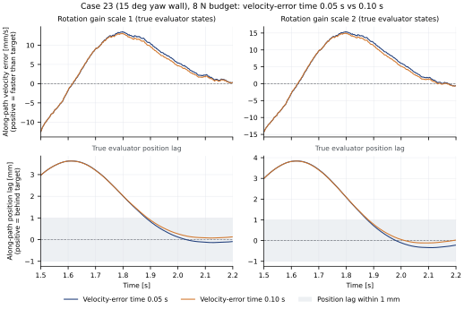

# 速度误差时间系数加倍：速度代价下降，追赶略慢

只把 $T_v$ 从 0.05 s 改到 0.10 s，四个同预算对照的整段切向速度 RMS 都降低了，
位置 RMSE 也略有降低。但 8 N 两组进入沿向误差带分别晚了 6 ms、4 ms，累计落后量增加。
姿态增益 `s=2` 的 8 N−6 N 速度代价仍超过原门槛。

本轮决定为 `do_not_expand`，默认仍是 $T_v=0.05\,\mathrm{s}$、6 N、`s=1`。
没有扩大原 24-case 网格，也没有加入新的更新门控或继续扫参数。

## 两种差值分开看

实验限定 case 23：表面 yaw +15°，接触时间常数 0.012 s，仿真工具质量 0.13 kg，seed 29。
姿态增益取 `s=1/2`，补偿预算取 6 N／8 N。四条 0.05 s 基线复用
[内部观测归档](../results/franka_onset_observer/)，只新增四次 0.10 s 仿真；每次 4.5 s、控制周期 2 ms。
这仍是一个预选物理配置的开发对照，不能增加独立场景数或回写旧 24-case 通过率。

先看同一 $T_v$ 下，增加预算带来的速度代价：
$C(T_v)=\mathrm{RMS}_{v,8N}(T_v)-\mathrm{RMS}_{v,6N}(T_v)$。
下表使用完整评估区间 $[1.5,4.5)$，单位 mm/s。

| 姿态增益 | $C(0.05)$ | $C(0.10)$ | 0.10 s 是否满足原 +0.2 mm/s 门槛 |
|---|---:|---:|---|
| s1 | +0.294089 | +0.178375 | PASS |
| s2 | +0.356872 | +0.241981 | FAIL |

再看同一预算下，改时间系数本身的影响。下表差值均为 0.10 s 减 0.05 s。
负 RMS 差值表示误差降低；正落后面积差值表示累计落后增多。

| 增益／预算 | 速度 RMS 差值 (mm/s) | 位置 RMSE 差值 (mm) | 正沿向落后面积差值 (mm·s) | 首次进入误差带的时间差 (ms) |
|---|---:|---:|---:|---:|
| s1／6 N | −0.020212 | −0.002387 | +0.032793 | 0 |
| s1／8 N | −0.135926 | −0.011713 | +0.200280 | +6 |
| s2／6 N | −0.036290 | −0.003581 | +0.053424 | 0 |
| s2／8 N | −0.151182 | −0.015789 | +0.174784 | +4 |

这里的速度代价下降并非靠恶化 6 N 参照取得，四条轨迹的速度 RMS 都下降了。
但不能把位置 RMSE 下降写成“追赶没有变慢”：四组的正沿向落后面积都增加，
8 N 两组整段面积分别从 1.545717 增到 1.745997 mm·s、从 1.598827 增到 1.773611 mm·s。
在主窗口 $[1.5,2.0)$，8 N 的面积也分别增加 0.013337、0.010892 mm·s。
同窗口的 s1／8 N 位置 RMSE 增加 0.002935 mm；整段均值会掩盖这项局部代价。

四条新轨迹的接触率均为 100%，力矩裁剪和包络投影占比为 0%，原始接触峰值没有增加，
预留力矩余量均大于 4.66 Nm。同预算时间系数对照的原相对门槛全部通过。
阻止扩网的是 s2 的预算速度代价仍未过 +0.2 mm/s，追赶统计另列为实际代价，不拿它替换原判据。
原始数字见 [comparison.csv](../results/franka_velocity_time/comparison.csv)、
[catchup.csv](../results/franka_velocity_time/catchup.csv)与
[screening.json](../results/franka_velocity_time/screening.json)。



图中只画 8 N、两档增益的启动片段 $[1.5,2.2)$，不代替上表整段统计。
上排是实际速度减目标速度的单位沿向分量，正值表示超速；下排是目标位置减实际位置的沿向落后，
灰带为 ±1 mm。两排都使用仿真真实状态。图中速度误差的符号与控制器的目标减测量误差相反，
投影方向也不同于下文更新律的柔化方向 $d$。0.10 s 在片段后段超速较小，但追赶也稍慢。

## 为什么要另算追赶

在每个采样，先把目标速度投影到真实表面切平面并归一化，得到 $\hat t$。
定义沿向落后 $\ell=(p_d-p)^T\hat t$，正值表示实际位置仍落后于同一时刻的目标。
这里用仿真真实位置打分，控制器仍只接收测量状态；这个指标不是到几何路径的最近距离。

正落后面积按左端采样计算：$A_+=1000\Delta t\sum_k\max(\ell_k,0)$，单位 mm·s。
它只累计落后的一侧。位置 RMSE 则对整个切向向量平方后求均值，两者可以朝不同方向变化。

“首次进入误差带”指最早满足连续 50 个采样 $|\ell|\le1\,\mathrm{mm}$ 的起始时间戳，
按 2 ms 零阶保持计为 100 ms；区间必须完整落在评价窗口内。它不表示此后永不离开误差带。
例如 s1／6 N 在整段中为 1.908 s，但从 1.908 s 起的 50 点跨过了 2.0 s，
所以 onset 子窗口返回空值。空值表示该窗口中没有完整合格片段，不表示机器人没有接触。

[纯轨迹分析器](../tools/velocity_time_metrics.py)负责这些统计，整段位置和速度 RMS
还要与旧 public24 指标独立复算出的值一致。最大正落后量也保留在 CSV 中。

## 系数加倍不等于每时每刻都抑制更新

原更新驱动是 $d^T(e_p+T_v e_v)$，其中 $d$ 是原补偿器的柔化切向方向，
不同于评价用的单位向量 $\hat t$。 $T_v$ 是速度误差的权重，单位为秒；本轮没有添加任何测量或执行延迟。

两种时间系数的更新后系数从 1.538 s 开始不同，补偿请求在 1.540 s 才不同，
测量状态在 1.542 s 才不同。这个顺序与“本周期更新供下一周期使用”一致，
也与[预算限幅对照](onset_observer.md)中限幅直接改变当周期请求的顺序不同。

在 $[1.5,2.0)$，8 N 的平均速度项变得更负，正更新占比由 82.4%／74.4% 降到 72.0%／64.8%。
首次允许更新的 1.538 s，方向加权速度误差 $d^T e_v$ 却为正：s1 为 +7.896 mm/s，s2 为 +9.861 mm/s。
增大 $T_v$ 直接增强了该周期的正增量。这个逐周期观测反例说明，不能由整个窗口的负均值断言每一步都受到更强抑制。
完整观测见 [observer_windows.csv](../results/franka_velocity_time/observer_windows.csv)和
[events.csv](../results/franka_velocity_time/events.csv)。本页不把窗口相关性解释成全部性能差值的因果分解。

## 固定判据与复核

若要连同预算转移、窗口分解和内部观测一起检查，可运行[证据链复核命令](velocity_evidence_audit.md)。

[协议](../results/franka_velocity_time/protocol.json)在新仿真前固定：四个同预算对照的速度 RMS
不能增加，数值容差为 $10^{-12}\,\mathrm{m/s}$；位置保留原 +0.10 mm 容限，控力和姿态等原门槛也不变。
两档增益的预算速度代价都必须下降，新的 8 N−6 N 对照必须通过原兼容性门槛，才允许扩大网格。
落后面积和首次进入时间用于诊断，不是临时补进的拒绝理由。

[运行工具](../tools/velocity_time_runner.py)复制原控制器配置，只替换 `velocity_error_time`；
[归档工具](../tools/velocity_time_study.py)在执行前检查父归档哈希和源码，核对只有这个构造参数不同。
新轨迹还需通过原轨迹格式检查，并按实际 $T_v$ 复算内部系数更新。
本轮环境是 Python 3.10.12、NumPy 2.2.6、MuJoCo 3.12.0。

完成[安装](../README.md#安装后快速复核)后，在仓库根目录执行：

```bash
# 只读审计，不重新运行仿真
python -m tools.velocity_time_study --audit results/franka_velocity_time

# 从两份已校验归档重画图，不运行仿真；输出文件必须不存在
python -m tools.plot_velocity_time --output /tmp/velocity-time-8n-01.svg

# 四次新仿真，复用四条旧基线；输出目录必须不存在
python -m tools.velocity_time_study --output /tmp/compliant-control-velocity-time-01
```

审计 JSON 应含 `"audit_status": "PASS"`、`"new_simulations": 4`、`"reused_traces": 4`、
`"decision": "do_not_expand"`。这里的四次是归档生成时的计数，审计命令自身不增加仿真。
审计 PASS 表示数据和判据能复算出来，不会把 s2 的性能 FAIL 改成 PASS。
