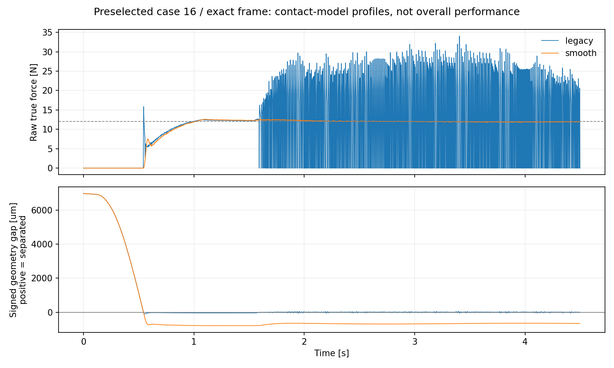

# 擦拭为什么会断续接触

这次修正的是 MuJoCo 表面任务的接触模型。保持控制器、摩擦系数、轨迹和噪声不变，
显式启用 `contact_model="smooth"` 后，24 个开发 case × 4 组坐标设置全部保持接触。
准确法向组的未滤波力 RMSE 中位数从 10.916 N 降至 0.181 N。

代价也很具体：模型允许更大的软接触压入量，代表 case 约为 0.67 mm；切向 RMSE 仍约
11.8 mm。这不是控制算法性能提升，也没有证明真实工具材料具有这种柔度。默认路径仍为
`legacy`，旧数据不覆盖，v0.5 的 `FAIL` 不变。

## 先确认掉的是力，还是接触

旧模型中，滤波力接近 12 N，但真实接触力频繁降到零。预选 case 16 的准确法向轨迹在
1.5–4.5 s 内有 704/1500 个采样点失去承载；对应的几何间隙也为正。这是仿真中的真实
微分离，不只是传感器读数抖动。最大间隙约 47 μm，所以仅看机器人动画很难发现。

本项目用 `g = n · (p_wall − p_TCP) − r_tool` 记录间隙，`g > 0` 为分离，`g < 0` 为
软接触压入。球形工具半径为 25 mm。测试还把这个几何量与 MuJoCo 的实际 `contact.dist`
对照，覆盖 −15°、0°、+15° 墙面，不只比较两次相同公式的计算结果。



图中保留全部采样，未用滤波后的曲线代替真值。下半图包含接近阶段的毫米级间隙，因此旧
模型的微米级分离不显眼；逐 case 最大分离量保存在 CSV，代表轨迹保存在 NPZ。

## 每次只改变一个因素

先去掉噪声、偏置和墙面转角，把问题缩到 3 s 擦拭。下表的接触率与 raw-force RMSE 都
使用 [1.5, 3.0) s，peak 使用完整 3 s。每次重置模型、控制器和随机数流。

| 相对同一基线的唯一改动 | 接触率 [%] | Raw RMSE [N] | Raw peak [N] |
|---|---:|---:|---:|
| 无改动 | 61.20 | 10.044 | 26.558 |
| 1.2 s 后保持位置，不再擦拭 | 100.00 | 0.139 | 13.447 |
| 法向 P 设为 0 | 61.60 | 9.989 | 25.558 |
| 法向 I 设为 0 | 61.07 | 10.018 | 26.068 |
| 法向基础阻尼从 10 改为 60 | 61.60 | 9.946 | 25.352 |
| 取消力滤波 | 62.80 | 9.870 | 29.212 |
| 滤波时间常数改为 5 ms | 61.07 | 10.127 | 27.067 |
| 两个接触 geom 的滑动摩擦系数改为 0.1 | 89.60 | 4.211 | 15.311 |
| 两个 geom 的滑动摩擦输入设为 0 | 100.00 | 0.177 | 12.433 |
| 两个 geom 的 `solimp d0` 改为 0.5 | 99.47 | 0.947 | 13.770 |
| `impratio` 改为 10 | 60.53 | 10.201 | 27.667 |
| 两个 geom 的 `solimp d0` 改为 0 | 100.00 | 0.224 | 12.553 |

完整参数和统计见 [one_factor.json](../results/franka_surface_contact_diagnostics/one_factor.json)，
脚本是 [contact_oscillation_probes.py](../tools/diagnostics/contact_oscillation_probes.py)。
JSON 保存统计与版本信息，不包含这 12 次试验的完整原始轨迹。

停止擦拭会消除症状，减小摩擦也有明显作用；单独改 P、I、阻尼或滤波没有解决问题。
这把排查范围缩到带摩擦的接触动力学。不能因此删掉摩擦：那会换掉需要解决的任务。

## 实际改了哪一项

MuJoCo 的 `solimp` 描述约束阻抗随距离的变化。`d0` 是零距离处的阻抗参数。
官方文档建议对平滑接触使用 `d0=0`；引擎内部仍有最小阻抗截断，因此不能说反力在
边界上严格为零。[MuJoCo solver parameters](https://mujoco.readthedocs.io/en/stable/modeling.html#solver-parameters)

工具和墙的优先级相同，`solmix` 也相同，实际接触参数由两者混合。只改墙面不够，
所以 `run_surface_trial` 中对两个 geom 都设置 `solimp[0]=0`。修改后实际混合参数从
`[0.925, 0.97, 0.0015, 0.5, 2]` 变为 `[0, 0.97, 0.0015, 0.5, 2]`。
摩擦混合规则与阻抗不同，不能用墙面单个输入值代替求解器实际值。
[MuJoCo contact parameters](https://mujoco.readthedocs.io/en/stable/modeling.html#contact-parameters)

控制器参数、工具质量与惯量、摩擦、`solref`、碰撞 margin、积分器均未改变。
原来的 0.005/0.012 s 墙面时间常数与工具的 0.020 s 混合后，实际分别为 0.0125/0.016 s。
改动后仍有切向接触载荷，承载样本的 `||Ft||/Fn` 中位数为 0.45。

`d0` 同时改变接触起始响应和力—距离关系。当前实验没有在相同稳态柔度下单独比较
激活方式，因此只能把改善归于这项接触模型改变，不能声称已分离出“连续性”的独立贡献。
在同一个无噪声 3 s 探针中，整个评估窗口的压入中位数从约 4 μm 变为 740 μm；两边
都包含全部窗口样本。它不是材料辨识结果，不能拿来设置真实工件的允许变形。

## 完整 24-case 对照

每个 case 保留原来的 4.5 s、seed、质量、墙面参数及任务轨迹；四组分别使用世界坐标、
准确法向、−5° 与 +5° 标定偏差。先重跑全部旧模型，再运行平滑模型，共 192 次。
旧模型的 96 组指标与原归档的最大绝对差为 0。

| 坐标设置 | 接触率中位数：旧 → 新 [%] | Raw RMSE 中位数：旧 → 新 [N] | 新模型最大全程 peak [N] | 切向 RMSE 中位数：旧 → 新 [mm] |
|---|---:|---:|---:|---:|
| 世界坐标 | 57.13 → 100 | 11.089 → 1.498 | 15.245 | 12.467 → 12.742 |
| 准确法向 | 56.67 → 100 | 10.916 → 0.181 | 12.653 | 11.811 → 11.800 |
| −5° 标定偏差 | 56.80 → 100 | 10.899 → 0.529 | 13.293 | 11.776 → 11.825 |
| +5° 标定偏差 | 56.80 → 100 | 10.995 → 0.367 | 12.832 | 12.066 → 12.034 |

新模型每个 case 的接触率都是 100%，力矩饱和率都是 0%。工程修复检查为接触率 ≥99%、
raw RMSE ≤2 N、全程 peak ≤35 N、饱和率为 0；新模型 96/96 满足，旧模型 0/96 满足。
这些检查用于本次公开开发修复，不是补写的 holdout 门槛，没有切向误差或材料变形 gate。
世界坐标组的切向误差略有增加，不能把接触改善概括成所有指标都改善。

逐 case 数据见 [comparison.csv](../results/franka_surface_contact_fix/comparison.csv)，
配对差值见 [paired_deltas.csv](../results/franka_surface_contact_fix/paired_deltas.csv)，
实际配置和文件哈希见 [manifest.json](../results/franka_surface_contact_fix/manifest.json)。
四份代表 NPZ 可重放控制输入，但输入重放不等于重新积分闭环动力学。

## 会不会只是 500 Hz 没采到振荡

在原始有噪声 case 16 上，把每个 2 ms 控制周期分成 1、4、8 个物理子步。控制器、滤波器、
噪声抽样仍为 500 Hz；力矩在子步中保持，第一子步的 F/T 测量缓存到下一控制周期。
这样不会把“物理积分更细”和“控制或传感器更新更快”混为一谈。

| 平滑模型子步数 | 全物理采样 raw RMSE [N] | 全物理采样 peak [N] | 全物理采样接触率 [%] | 承载压入中位数 [μm] |
|---:|---:|---:|---:|---:|
| 1 | 0.184050 | 12.620730 | 100 | 666.109 |
| 4 | 0.183964 | 12.620164 | 100 | 665.769 |
| 8 | 0.183949 | 12.620051 | 100 | 665.730 |

这些数使用所有物理子步，不只抽取 500 Hz 的点。评估区间都是 [1.5, 4.5) s，peak 使用
完整轨迹。新模型没有被抽样隐藏的失联片段；但步长一致性仍不等于模型符合真实材料。
完整统计与采样约定见 [step_refinement.json](../results/franka_surface_contact_diagnostics/step_refinement.json)，
旧模型的同口径对照见 [legacy_step_refinement.json](../results/franka_surface_contact_diagnostics/legacy_step_refinement.json)。
旧模型在 1、4、8 子步下的全物理采样接触率分别为 53.07%、55.13%、55.18%，raw RMSE
分别为 11.736、10.987、10.844 N。细化减少了间隙和峰值，但没有消除断续承载；这也不代表
已证明零步长极限的行为。
这两份 JSON 保存聚合统计；只有 N=1 能直接用已发布的代表 NPZ 独立重算，N=4/8 需重跑脚本。

## 自己复现

安装方法见[教程环境说明](tutorial/README.md#环境与第一轮复现)。在仓库根目录执行，
输出路径必须是新目录或新文件；不要指向已发布的结果目录。

```bash
python -m compliant_control_lab.surface_contact_validation --output results/contact-check-local
python tools/diagnostics/contact_oscillation_probes.py --output results/contact-probes-local.json
python tools/diagnostics/contact_step_refinement.py --output results/contact-step-local.json
python tools/diagnostics/contact_step_refinement.py --contact-model legacy --output results/contact-step-legacy-local.json
pytest tests/test_surface_contact_stability.py tests/test_contact_step_refinement.py
pytest tests/test_surface_contact_validation.py tests/test_surface_contact_published_results.py
```

单次仿真可显式选择模型：

```python
from compliant_control_lab.surface_simulation import (
    SurfaceSimulationConfig, run_surface_trial, yaw_frame,
)

trial = run_surface_trial(yaw_frame(0), config=SurfaceSimulationConfig(contact_model="smooth"))
print(trial.metrics())
```

后续若要比较新的自适应算法或 residual，应先固定同一个接触模型和评价协议。要走向真机，
还需要工具/工件的力—位移测量、传感器标定和实际执行器约束；不能用这次仿真的通过数代替。
