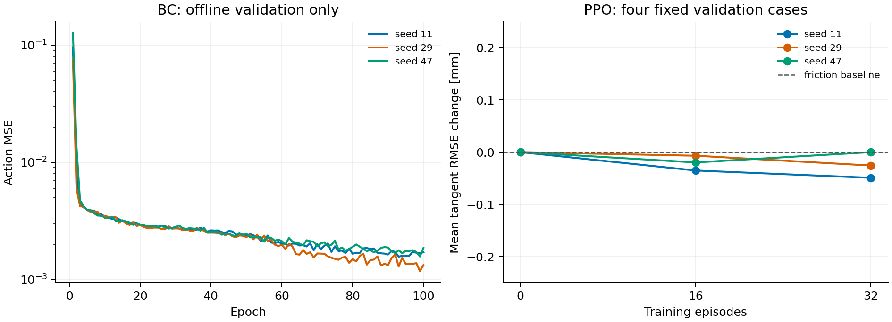

# 小规模 BC / bounded Residual PPO 结果

训练种子为 11、29、47。24 个公开 case 按组分为 16 train、4 validation、4 development_test。
下表仅统计四个开发测试 case；重复训练种子不增加独立场景数，也不构成新盲测。

| 方法 | 安全完成 | 跟踪门槛 | 平均切向 RMSE [mm] | 平均法向力 RMSE [N] | 最低接触率 [%] |
|---|---:|---:|---:|---:|---:|
| bc_seed11 | 4/4 | 0/4 | 14.787 | 0.204 | 100.000 |
| bc_seed29 | 4/4 | 4/4 | 3.801 | 0.212 | 100.000 |
| bc_seed47 | 4/4 | 2/4 | 8.721 | 0.198 | 100.000 |
| ppo_seed11 | 4/4 | 4/4 | 2.467 | 0.204 | 100.000 |
| ppo_seed29 | 4/4 | 4/4 | 2.470 | 0.202 | 100.000 |
| ppo_seed47 | 4/4 | 4/4 | 2.381 | 0.204 | 100.000 |
| zero_adaptive | 4/4 | 0/4 | 12.445 | 0.201 | 100.000 |
| zero_friction | 4/4 | 4/4 | 2.403 | 0.202 | 100.000 |
| friction_teacher_50hz | 4/4 | 4/4 | 2.624 | 0.203 | 100.000 |

## 模型选择

BC 每种子完整训练 100 epoch，按完整验证动作 MSE 选择。

| BC seed | 选中 epoch | 验证动作 MSE | 零动作 MSE |
|---:|---:|---:|---:|
| 11 | 93 | 0.00156379 | 0.267155 |
| 29 | 99 | 0.00117996 | 0.267155 |
| 47 | 99 | 0.00157012 | 0.267155 |

PPO 每种子固定尝试 32 个训练回合，只比较第 0、16、32 回合检查点。
第 0 回合是未训练的零残差；若被选中，不能称为 RL 优于强基线。

| PPO seed | 选中回合 | 验证资格 | 开发测试门槛 |
|---:|---:|---|---|
| 11 | 32 | True | PASS |
| 29 | 32 | True | PASS |
| 47 | 16 | True | PASS |

完整验证检查点如下。数值是四个 case 的均值，资格仍要求每个 case 分别过门槛。

| PPO seed | 回合 | 平均切向 RMSE [mm] | 平均法向力 RMSE [N] | 合格 |
|---:|---:|---:|---:|---|
| 11 | 0 | 4.579 | 0.145 | True |
| 11 | 16 | 4.544 | 0.144 | True |
| 11 | 32 | 4.530 | 0.148 | True |
| 29 | 0 | 4.579 | 0.145 | True |
| 29 | 16 | 4.572 | 0.145 | True |
| 29 | 32 | 4.553 | 0.144 | True |
| 47 | 0 | 4.579 | 0.145 | True |
| 47 | 16 | 4.559 | 0.147 | True |
| 47 | 32 | 4.579 | 0.147 | True |



图中曲线用于模型选择，均来自 validation，未使用 development_test。
PPO 图绘制相对摩擦强基线的误差差值，负值表示降低，单位是 mm。
每种子只有 8 次 PPO 采样更新，不能据此声称训练收敛。

## 复核范围

[逐 case 对照](development_comparison.csv)保留所有种子，差值详见 [BC](bc_summary.json) 与 [PPO](ppo_summary.json) 的 paired_baselines。
[plan.json](plan.json)记录训练前固定的预算和源码身份；[选择记录](ppo_selection.json)保留全部 PPO 检查点的验证结果。
[闭环动作复核](bc_closed_loop_errors.json)在已经保存的验证状态上重新计算教师动作，用于比较离线 MSE 与学生实际访问状态上的误差，不重新训练或挑选权重。
[导出复核](bc_export_check.json)用保存的 NumPy 候选重新计算离线验证 MSE，并与训练记录比较。

本目录是小体积公开副本：包含全部评测候选权重、训练统计与评价报告。
附带 BC 与 PPO 各一份完整物理 NPZ，按首个训练种子、首个开发 case 选择，不是挑选最好表现。路径见[代表轨迹索引](representative_traces.json)，[重算记录](representative_physics_audit.json)核对全部物理指标。其余轨迹与逐决策事件日志留在本地。
各子目录的 source_manifest.json/source_COMPLETE 是原完整产物的哈希记录，不能当作本目录含有全部原始文件的证明。根 manifest.json 只校验实际分发的文件。

```bash
python -m tools.publish_surface_learning_pilot --audit results/franka_surface_learning_pilot
```

该命令检查公开文件哈希、重算 PPO 选择及两份轨迹指标，不会重新积分动力学；完整重训与闭环复现见[算法和命令](../../docs/surface_learning_pilot.md)。
旧 v0.5 的 FAIL 不变。全部候选仅用于仿真，禁止直接用于真机。
